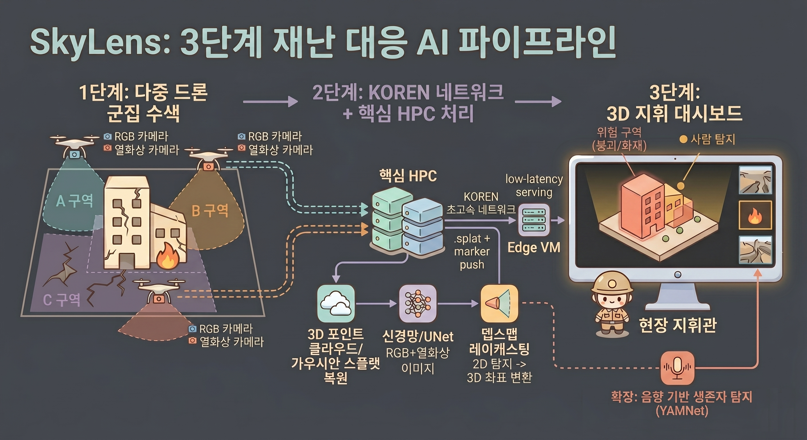

---
tags:
  - project
  - 넷챌린지
  - intent
  - drone
  - 3D
parent: '[[넷 챌린지 캠프]]'
related: '[[SPEC.md]], [[ARCHITECTURE.md]], [[COMPONENTS.md]]'
---

# SkyLens 의도 (Intent)

이 문서는 **왜 이걸 하는가**와 **무엇을 주장하는가**를 적는다.
현재 시스템이 어떻게 생겼는지는 [SPEC.md](SPEC.md)가, 각 주장을 검증한 결과는 실험 PR이 갖는다.

- 과제명(안): **SkyLens: 멀티드론 영상을 KOREN 분산 AI로 실시간 3D 복원하고, 그 위에 위험구역·사람을 AI로 표시하는 재난 인텔리전스 플랫폼**
- NET 챌린지 캠프 시즌13

---

## 1. 문제

소방드론 출동은 2019년 738건에서 2024년 4,600건으로 6배 이상 늘었고 [^f1] [^f7], 전국 소방관서에 554대가 배치돼 있다. 그런데 현재 소방드론이 하는 일은 **실시간 영상 중계가 전부다** [^f2]. 위험 요소를 자동으로 감지하거나 소리로 생존자를 찾는 기능은 없다. 소방청이 '소방드론 협의회'를 신설하고 [^f8] 충남도가 별도로 "드론영상 AI 분석시스템 구축"에 나선 것 [^f9] 자체가 그 부재를 보여준다.

현장 정보가 부족하면 대원의 안전이 직접 위협받는다. 2001년 홍제동 화재에서는 내부 구조를 모른 채 진입한 소방관 10명이 붕괴로 매몰돼 6명이 사망했다 [^f3]. 진입 전에 건물의 형상과 붕괴 징후를 볼 수 있었다면 진입 판단이 달랐을 것이다.

기존 드론 생존자 탐지는 열영상에 의존하는데, 잔해가 두꺼우면 2m 깊이까지가 한계다 [^f5]. 소리를 쓰면 더 깊은 곳도 찾을 수 있지만 프로펠러 소음(약 80dB)이 사람 목소리(약 60dB)를 덮어 사실상 불가능했다. 2024년 시바우라공업대학의 AI 소음 억제 [^f6]와 2025년 공개된 SAR용 오디오 데이터셋 DroneAudioset [^f13]으로 이 장벽이 낮아지는 중이다.

KISTI 보고서도 재난 상황의 객체 탐지에는 영상 인식만으로 부족하고 **영상·음성·문자를 통합한 인지 모델**이 필요하다고 지적한다 [^f14]. 이런 통합 인지 드론 AI 플랫폼은 아직 상용화돼 있지 않다.

---

## 2. 목표

1. 멀티드론이 보낸 영상으로 **재난 현장을 준실시간 3D로 복원**하고, 지휘관이 진입 전에 형상을 보게 한다.
2. 같은 영상에 AI를 돌려 **위험구역과 사람을 감지**하고, 그 결과를 복원된 3D 위에 **실좌표 마커**로 얹는다.
3. 무거운 연산(3DGS 학습·AI 추론)은 Core HPC, 가벼운 배포·서빙은 Edge에 둬서 **연구망(KOREN)을 쓸 이유를 정량으로 보인다**.
4. 재난 상황을 가정하므로 **한 경로가 죽어도 서비스가 유지**되어야 한다.

### 2.1 AI 모델 목표 성능

재난 현장에서 사람과 위험구역을 **놓치지 않는 것**을 기준으로 정한다. 사람을 놓치면 되돌릴 수 없지만, 잘못 찍힌 마커는 지휘관이 한 번 더 확인하면 된다. 그래서 사람 검출은 재현율을 주 지표로 두고, 중간보고서와 비교할 수 있도록 F1 · mAP@0.5 목표도 유지한다.

재난 현장에서 사람과 위험구역을 함께 라벨링한 데이터는 많이 존재할 수 없다. 그래서 성격이 다른 여러 공개 데이터셋(열화상 보행자, 항공 소형 인물, 재난 항공 세그, 화재)을 한 모델에 함께 학습해(멀티태스크) 그 능력을 갖추게 한다. 평가도 같은 데이터셋들의 평가 분할로 한다.

| 구분 | 지표 | 목표 | 중간보고서 목표 |
|---|---|---|---|
| 사람 검출 | **정밀도 0.5 이상에서 재현율** | **0.85** | 없음 |
| 사람 검출 | 최저 임계값에서 재현율(찾을 수 있는 상한) | 0.90 | 없음 |
| 사람 검출 | 거리 기준 F1 | 0.70 | 0.70 |
| 사람 검출 | mAP@0.5 | 0.65 | 0.65 |
| 위험구역 | 전체 평균 IoU | **0.60** | 0.55 |
| 위험구역 | 붕괴 IoU | **0.65** | 0.45 |
| 위험구역 | 화재 IoU | 0.50 | 0.50 |
| 위험구역 | 도로 차단 IoU | **0.30** | 없음 |

- 사람 검출 지표는 실제 추론 방식으로 잰다(§6 닫힌 결정). 정밀도 0.5 는 마커 두 개 중 하나가 실제 사람인 수준으로, 지휘관이 확인 부담을 감당할 수 있는 하한으로 잡았다.
- 사람 목표는 LLVIP · VisDrone · SARD 세 평가셋을 합산해 판정한다. SARD 는 누운 사람과 탈진 · 부상 자세가 들어 있는 드론 수색 데이터로, 재난 수색 목적에 가장 가까운 평가셋이다.
- 사람 점 매칭 반경은 `max(8px, 0.15 × 사람 박스 높이)` 를 주 지표로 쓴다. 최종 산출물은 3D 좌표로 투영할 점 하나라, 점이 사람 몸 위에 있으면 목적을 만족한다. 고정 8px 은 키 120px 인 사람에게 몸 안의 좁은 한 점을 요구하므로, 비교용으로만 함께 적는다.
- 위험구역 목표는 채택된 모델이 중간보고서 목표를 넘은 뒤 올렸다(평균 0.630, 붕괴 0.739, 화재 0.502, 도로 차단 0.349, research v3).
- 성능 보고는 `지표 | 우리 성능 | 우리 목표 성능 | 선행 연구 성능` 네 칸으로 적는다(사용자 지시 2026-09-20). 사람 지표는 LLVIP + VisDrone 합산과 SARD 를 나눠 적는다. 선행 연구 칸은 가능하면 우리 채점 방식으로 환산한 값을 쓴다. 공개 논문의 수치는 데이터셋 전용 모델을 저자 분할에서 박스 IoU 로 잰 것이라 그대로는 같은 축이 아니므로, 같은 검출기를 우리가 학습해 우리 프로토콜로 다시 재는 방식을 쓴다. 환산이 불가능한 값은 그대로 적되 조건 차이를 한 줄로 밝힌다.

---

## 3. 주장 (Claims)

각 주장은 실험이 검증한다. 실험 PR의 YAML에 `claims: [N1]` 형태로 어떤 주장을 다루는지 적는다.

### N1. 구간 단위로 나눠 복원하면 촬영이 끝나기 전에 3D 현장을 볼 수 있다

전체 촬영을 모아 한 번에 복원하면 결과는 항상 사후다. 드론이 지나간 구간부터 복원해 내보내면 비행 중에 앞 구간을 볼 수 있다.

### N2. 낮은 품질을 먼저 확정해 띄우고 뒤에 정제하는 편이, 최종 품질을 기다리는 것보다 지휘 판단을 빨리 준다 (딜레이 패턴)

한 구간을 수준 1(250 스텝)부터 수준 4(7,000 스텝)까지 단계적으로 올린다. 앞 구간이 정제되는 동안 다음 구간의 수준 1이 도착하므로, 화면에는 서로 다른 수준의 구간이 동시에 올라온다. 주장의 핵심은 **"쓸만한 판단이 가능해지는 시점"이 앞당겨진다**는 것이다.

### N3. RGB와 열화상을 입력단에서 합친 4채널 단일 백본 하나로 위험구역과 사람을 동시에 감지할 수 있다

세그 헤드가 위험구역(stuff: 붕괴·화재)을, 점 검출 헤드가 사람을 맡는다. 백본을 둘로 나누지 않아도 두 과제가 함께 성립한다.

### N4. Depth Map 레이캐스팅으로 2D 탐지 결과를 3D 세계좌표에 투영할 수 있다

드론 포즈와 깊이만 있으면 핀홀 역투영으로 마커 좌표가 나온다. 별도의 3D 탐지 모델이 필요 없다.

### N5. 다중 드론의 동시 스트림은 일반망에서 병목이고, KOREN 고속망에서는 병목이 아니다

같은 파이프라인을 두 경로에 태워 동시에 측정한다. 대조군이 있어야 연구망 필연성이 주장이 아니라 수치가 된다.

### N6. 경로를 이중화하면 코어 장애 중에도 현황판이 마지막 상태를 유지하고, 복구 시 자동으로 돌아온다

재난 대응 시스템이므로 부분 장애가 전체 중단이 되면 안 된다.

### N7. (확장) 환경음 분류로 사람 confidence를 보정하면 열영상만으로 놓치는 생존자를 찾을 수 있다

YAMNet으로 구조 요청·환경음을 분류해 해당 구역의 사람 confidence를 올린다. 드론이 여럿이면 소리 발생 위치를 삼각측량할 수 있다. 이번 단계의 필수 범위가 아니라 확장이다.

---

## 4. 제약

| 제약 | 내용 |
|---|---|
| 하드웨어 | 실제 드론 비행·촬영이 어렵다. 사전 촬영 영상과 스마트폰/웹캠 PoC로 대체한다. |
| 회선 | KOREN 회선 위 실배치는 아직 없다. 컴포넌트 경계만 그 형태로 맞춰 둔다. |
| 데이터 | "RGB+열 페어 + 재난 + 사람 + 위험구역"을 모두 가진 공개 데이터셋은 없다([DATASETS.md](DATASETS.md)). 3축(4채널 정합 / 위험구역 세그 / 사람 인스턴스)을 조합해 학습한다. |
| 실시간성 | 프레임 단위 완전 실시간 3DGS는 부담이다. 구간 단위 준실시간으로 간다. |
| 인력·기간 | 3D 복원과 영상 AI를 메인으로 두고, 소리는 확장으로 분리한다. |

---

## 5. 하지 않는 것 (Non-goals)

- **프레임 단위 실시간 3DGS.** 구간 단위 준실시간까지만 한다.
- **DB 연결.** 이번 단계는 인메모리로 두고 세션이 끝나면 데이터를 버린다.
- **클라이언트 간 P2P 스플랫 재분배.** 코어 직접 배포로 시작한다.
- **드론 자율 판단.** 판단 주체는 지휘관이고, 시스템은 정보를 준다.
- **시뮬레이션으로 빈칸 메우기.** 파이프라인이 없으면 화면은 **없다고 표시**한다. 그럴듯한 가짜를 그리지 않는다.

---

## 6. 열린 결정 (Open decisions)

답이 정해지면 위 주장이 바뀔 수 있는 질문들이다.

1. **실제 복원·추론을 언제 파이프라인에 붙이나.** 지금은 사전 제작 자산으로 대체하고, 연결 지점은 `PipelineUnavailable`로 명시돼 있다. 붙이는 순간 N1·N2의 수치가 처음으로 실측된다.
2. **증분 복원이 가능한가.** 구간마다 독립으로 복원하면 좌표계가 어긋난다. 좌표계를 고정한 채 이어 붙일 수 있는지가 미해결이다.
3. **전송 포맷을 `.spz`로 바꿀 것인가.** 전송량이 약 10배 줄어든다고 알려져 있으나 실측하지 않았다. N5의 측정 조건이 달라진다.
4. **포즈를 어디서 얻나.** RTK/IMU prior와 SfM 자기보정 중 어느 쪽에 얼마나 기댈지가 N4의 투영 정확도를 좌우한다.
5. **공유 백본 하나로 사람 검출 목표(§2.1)까지 올릴 수 있나.** research v3 모델(tiles-offset-head #43)은 실제 추론 방식 합산으로 F1 0.656, mAP@50 0.561 이고, 정밀도 0.5 이상에서 재현율은 약 0.74, 최저 임계값 재현율은 약 0.80 이다. LLVIP 는 mAP@50 0.84 로 높지만 임계값을 낮춰도 재현율이 0.73 에서 멈추고, VisDrone 은 타일 mAP@50 0.49 다. 평가 디코딩 오류를 고치고(#44) VisDrone 을 원본 스케일 타일로 학습하고(#39) 오프셋 헤드를 더해(#43) 올라왔고, 헤드 입력 FPN(#45)은 효과가 없었다. 답에 따라 N3 의 "단일 백본 하나로" 가 사람 헤드에 한해 바뀔 수 있다.

### 닫힌 결정

- **위험구역 클래스를 몇 개로 둘 것인가 → 4 개(0 normal / 1 fire / 2 collapse / 3 road_blocked).** 데이터가 4 클래스를 지탱한다. 5 에폭 학습에서 네 클래스가 모두 0 이 아닌 값을 냈고(balanced-5ep #29: road_blocked 0.1286), Dice 를 더하면 road_blocked 0.3362 · 위험구역 평균 0.6243 으로 목표 0.55 를 넘는다(combo-dice-wh #38). road_blocked 를 collapse 에 합칠 필요는 없다. 다만 road_blocked 는 cross-entropy 단독에서 3 에폭 이후에야 나타나므로 2 에폭 실행으로는 판정할 수 없다.
- **사람 목표는 어떤 평가로 판정하나 → 실제 추론 방식, 세 평가셋 합산, 키 비례 매칭.** LLVIP 는 전체 프레임을 512 로 줄여, VisDrone 과 SARD 는 짧은 변 765 로 맞춘 원본 스케일의 512 타일로 추론하고, 세 소스의 검출을 한 precision-recall 로 합산한다. 점 매칭 반경은 `max(8px, 0.15 × 박스 높이)` 다. LLVIP 에서 놓친 사람의 92% 가 24px 안에 검출이 있고 근처에 반응이 없는 사람은 전체의 2% 뿐이라, 고정 8px 은 위치 규약이 검출 실패로 잘못 세어졌다(사용자 승인 2026-09-14). 512 로 줄인 평가와 고정 8px 결과는 비교용으로 함께 적는다.
- **사람 데이터셋 사이에 전이가 성립하나 → 성립하지 않는다. 축마다 데이터가 필요하다.** 학습에서 한 소스씩 빼고 그 소스로 평가했다(실제 추론 방식, 키 비례 반경).

  | 학습에서 뺀 소스 | 그 소스 mAP@50 (전부 학습 → 제외) | 그 소스 최저 임계값 재현율 |
  |---|---|---|
  | SARD (수색 자세) | 0.7199 → 0.5360 | 0.8898 → 0.6837 |
  | VisDrone (도시 항공 소형) | 0.5104 → 0.1093 | 0.8666 → 0.1624 |
  | LLVIP (야간 열화상) | 0.8722 → 0.2221 | 0.9371 → 0.6985 |

  근거: experiment/holdout-sard (#59) · holdout-visdrone (#60) · holdout-llvip (#61). 자세 · 스케일 · 모달리티 세 축은 서로 대체되지 않는다. 특히 SARD 는 레시피를 v3 에서 v4 로 올려도 재현율 상한이 0.690 → 0.684 로 그대로였다. 다른 데이터셋으로 누운 자세를 배울 수는 없다는 뜻이다.

  그래서 멀티 데이터셋 공동 학습의 근거는 "전이" 가 아니라 **"하나의 모델이 세 축을 모두 감당하면서 서로를 깎지 않는다"** 다. SARD 1,417 장을 넣었을 때 SARD F1 이 0.577 → 0.805 로 오르면서 LLVIP F1(0.665 → 0.694)과 VisDrone mAP(0.491 → 0.510)도 함께 올랐다(#48).

  다만 공동 학습이 공짜는 아니다. 사람 표본의 43% 를 차지하는 VisDrone 을 빼면 LLVIP mAP 가 +0.016, SARD mAP 가 +0.079 오른다. 큰 소스가 자원을 더 가져간다.

---

## 7. 기존 방식과의 차이

| | 기존 소방드론 | 상용 3D 매핑 드론 (DJI 등) | SkyLens |
|---|---|---|---|
| 영상 | 실시간 중계만 | 사후 3D 모델링 (비실시간) | **구간 단위 준실시간 3D 복원(3DGS) + AI 오버레이** |
| 3D 시각화 | ❌ | ✅ (사후 정밀 모델) | ✅ **멀티드론 복원 위 AI 마커** |
| 위험·사람 감지 | 육안 판단 | 사후 분석 | ✅ **AI 자동 감지 (UNet, RGB+열화상 4채널)** |
| 2D→3D 결합 | ❌ | ❌ | ✅ **Depth Map 레이캐스팅으로 3D 좌표 투영** |
| 생존자 탐지(소리) | 열영상 (2m 한계) | ❌ | ✅ **(확장) YAMNet → 사람 confidence 보정** |
| 군집 운용 | ❌ (1대 운용) | ❌ | ✅ **구역 분할 + 상태 모니터링 + 데이터 통합** |
| KOREN 활용 | ❌ | ❌ | ✅ **고속 전송 + Core HPC 분산 AI** |

### 군집으로 얻는 것

| 항목 | 단일 드론 | 군집 (2~3대) |
|---|---|---|
| 탐색 범위 | 1개 구역 순차 | **2~3개 구역 동시** |
| 탐색 속도 | ×1 | **×2~3** |
| 소리 위치 추정 | ❌ (단일 지점) | ✅ **삼각측량 가능** |
| 장애 대응 | 1대 잃으면 관측 불가 | **잔여 드론이 커버** |

---

## 8. KOREN을 쓰는 이유

| KOREN 자원 | 활용 | 없으면 생기는 일 |
|---|---|---|
| **고속 네트워크 (10Gbps+)** | 드론 2~3대의 RGB+열화상+포즈 스트림 동시 전송 | 4K 다중 스트림이 LTE/5G에서 병목 (N5) |
| **Core HPC (GPU)** | 3DGS 학습 + UNet 추론 + 마커 투영 + 모델 학습 | 드론 온보드·로컬 PC로는 불가 |
| **Edge VM (가까운 PoP)** | 3D 뷰어 서빙 + 캐시 | 단말까지 지연 증가 (TTFV↑) |
| **Object Storage** | 스플랫·마커·영상 아카이브 | 사후 분석과 학습 데이터 축적 불가 |

---

## 각주

[^f1]: [재난현장 소방드론 출동, 3년 만에 2.7배 급증 (YTN사이언스)](https://m.science.ytn.co.kr/program/view.php?s_mcd=0082&key=202502261103135052)
[^f2]: [재난상황 대응, 드론으로 효율성 높여 (KNN)](https://news.knn.co.kr/news/article/157652)
[^f3]: [진화중 매몰 소방관 6명 사망 그후 (오마이뉴스)](https://www.ohmynews.com/NWS_Web/View/at_pg.aspx?CNTN_CD=A0000034520)
[^f4]: [17명 사상자 낸 광주 학동참사 책임자들 유죄 확정 (법률신문)](https://www.lawtimes.co.kr/news/articleView.html?idxno=210516)
[^f5]: [AI-Based Drone Assisted Human Rescue in Disaster Environments (Springer)](https://link.springer.com/article/10.1134/S1054661824010152)
[^f6]: [Advanced noise suppression technology for improved SAR drones (ScienceDaily)](https://www.sciencedaily.com/releases/2024/03/240306145036.htm)
[^f7]: [5년간 소방드론 출동 4배 늘어, 전문인력 양성 (시정일보)](https://www.sijung.co.kr/news/articleView.html?idxno=310033)
[^f8]: [전문가 모여 '소방드론' 재난현장 미래전략 구축 (소방청)](https://nfa.go.kr/nfa/news/pressrelease/press/?boardId=bbs_0000000000000010&mode=view&cntId=2638)
[^f9]: [충남도, 재난대응시스템에 드론·인공지능 접목한다 (보안뉴스)](https://m.boannews.com/html/detail.html?idx=130103)
[^f10]: [지난 10년간 위험직무 수행 중 소방관 42명 순직 (경향신문)](https://www.khan.co.kr/article/202402021321001)
[^f11]: [증가하는 소방공무원 순직·공상자…반복되는 비극 (한국경제)](https://www.hankyung.com/article/202402070719i)
[^f12]: [2015년 의정부 아파트 화재 경기도 책임 다시 따져봐야 (불교방송)](https://news.bbsi.co.kr/news/articleView.html?idxno=3145453)
[^f13]: [DroneAudioset: An Audio Dataset for Drone-based SAR (arxiv)](https://arxiv.org/pdf/2510.15383)
[^f14]: [재난/위급 상황 대처를 위한 통합 인지 드론 AI 개발 (KISTI)](https://scienceon.kisti.re.kr/srch/selectPORSrchReport.do?cn=TRKO202300005246)
