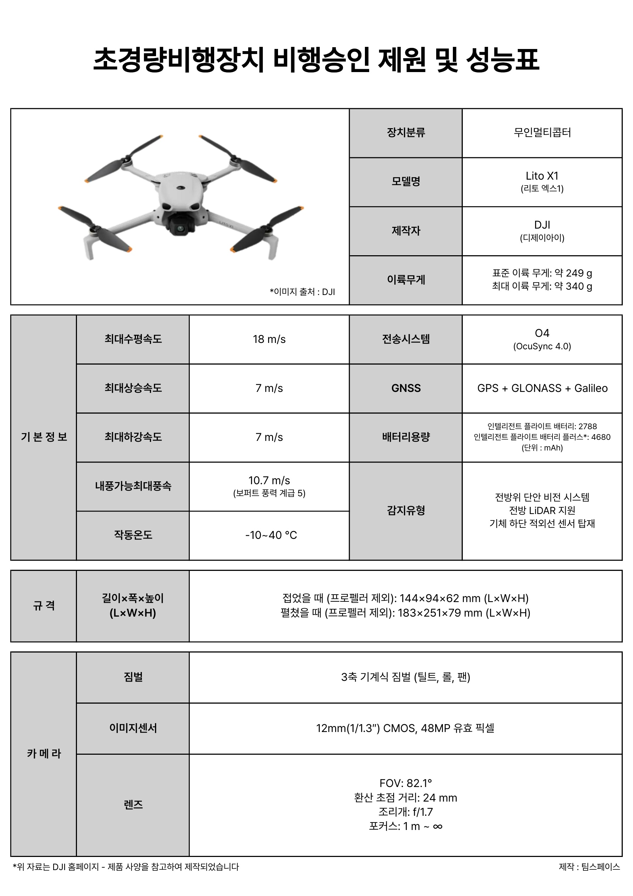
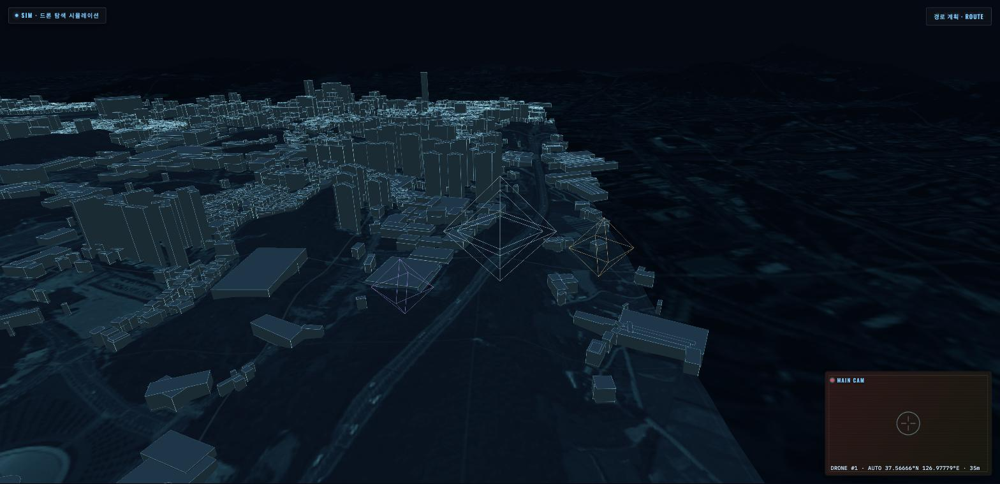
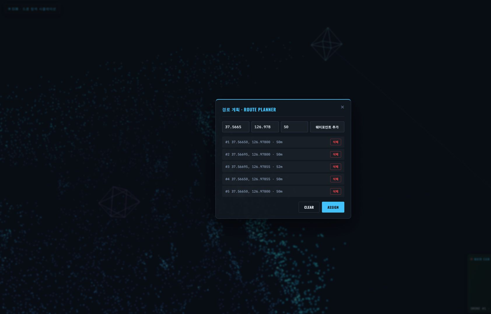
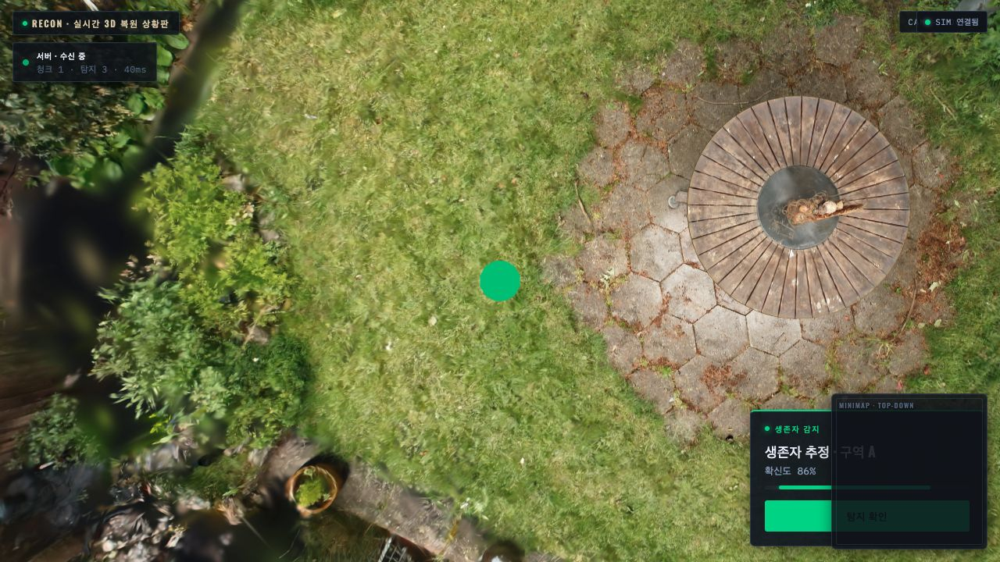
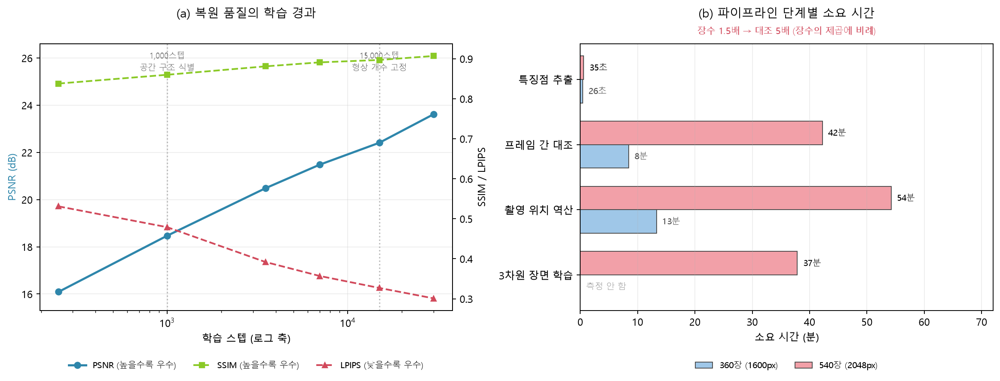
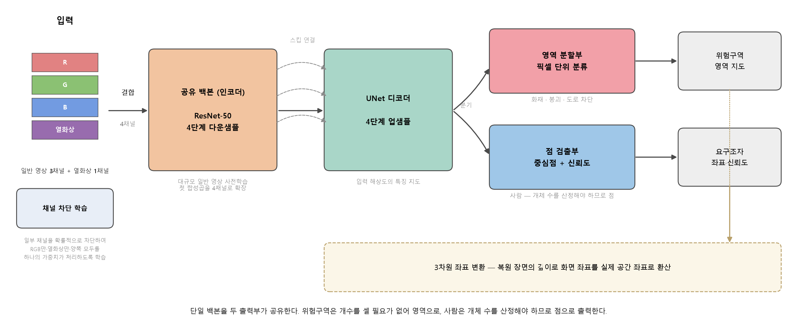
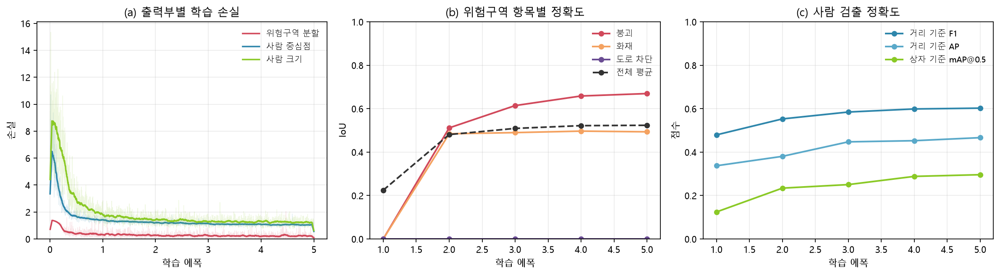
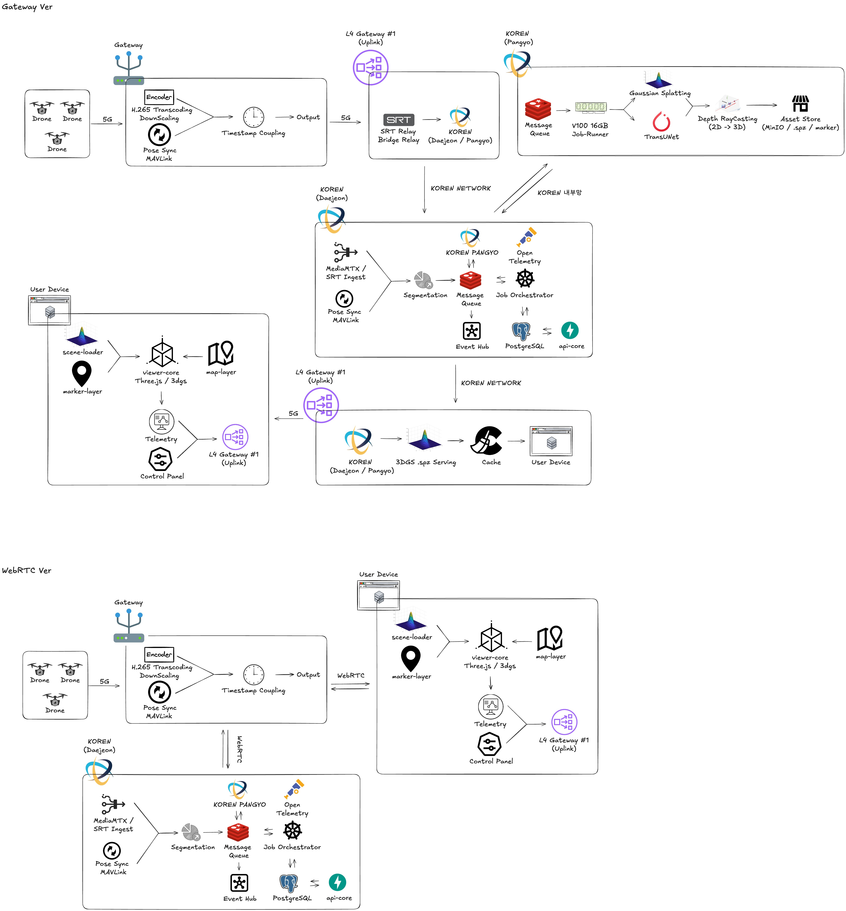
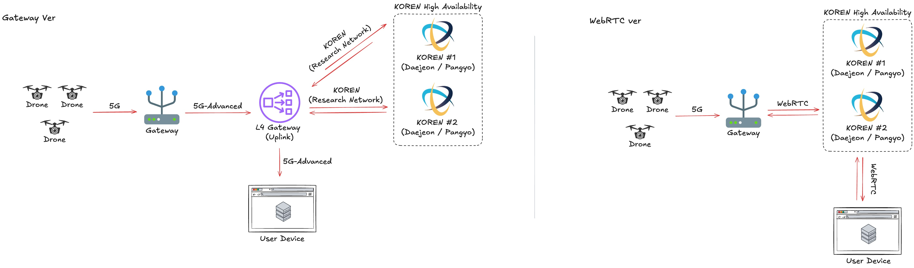

# K-디지털 챌린지: 넷 챌린지 캠프 시즌13 중간보고서

## 표지

| 항목 | 내용 |
|---|---|
| 과제 제목 | 멀티드론 기반 재난 현장 실시간 3D 상황인식 시스템 |
| 팀명 | 마당을 나온 드론 |
| 제출일 | 2026년 8월 17일 |

참여 구성원 (팀장부터 기재)

- 정준모 (충남대학교 컴퓨터융합학부)
- 나소진 (충남대학교 컴퓨터융합학부)
- 문채운 (충남대학교 인공지능학과)
- 박상우 (충남대학교 컴퓨터융합학부)

---

# 요약문

## 1. 제목

멀티드론 기반 재난 현장 실시간 3D 상황인식 시스템 (SkyLens)

## 2. 아이디어 개발의 목적 및 필요성

소방드론 출동 건수는 2020년 1,231건에서 2024년 4,623건으로 연평균 약 40% 증가하였다. 2023년 12월 기준 전국 소방관서가 보유한 드론은 554대로, 재난 현장의 주요 장비로 자리 잡았다. 그러나 현재 소방드론의 역할은 영상을 실시간으로 중계하는 데 그친다. 위험 요소를 자동으로 감지하거나 구조가 필요한 사람을 탐지하는 기능은 갖추고 있지 않다.

현장 정보의 부족은 대원 안전과 직결된다. 건물 내부 구조나 붕괴 징후를 진입 전에 파악할 수 있는지 여부가 지휘관의 판단을 좌우하기 때문이다. 소방청의 '소방드론 협의회' 신설과 충청남도의 "드론영상 AI 분석시스템 구축" 추진은 현재 AI 기반 분석이 부재하다는 사실을 보여준다.

요소 기술은 이미 실용 단계에 도달하였다. 3D Gaussian Splatting(2023), UNet 계열 영역 분할 모델, 드론 소음 억제 기술(2024)이 각각 성숙하였으나, 이를 재난 대응이라는 하나의 목적으로 통합한 플랫폼은 아직 존재하지 않는다.

## 3. 아이디어 개발의 내용 및 범위

동일 사양의 드론 2~3대가 재난 현장을 구역별로 나누어 동시에 촬영한다. 촬영 영상은 KOREN 연구망을 경유하여 고성능 연산 서버(Core HPC)로 전송된다.

Core HPC는 두 가지 연산을 병행한다. 하나는 3D 복원이다. 여러 장의 사진에서 각 사진의 촬영 위치를 역산한 뒤 현장을 3차원 장면으로 복원하고, 새로 들어온 영상을 반영하여 주기적으로 갱신한다. 다른 하나는 AI 감지로, 동일한 영상에 일반 카메라 영상 3채널과 열화상 1채널을 결합한 4채널 입력을 적용하여 위험구역과 사람을 탐지한다.

AI가 2차원 영상에서 탐지한 위치는 거리 정보를 이용해 3차원 좌표로 변환되어 복원된 장면 위에 마커로 표시된다. 완성된 장면과 마커는 등록 IP를 보유한 브리지 노드가 저지연으로 전달하며, 지휘관은 웹 브라우저 기반 3D 상황판에서 위험구역과 요구조자의 위치를 확인한다.

화면은 관제탑과 현황판으로 분리하였다. 드론을 조종하는 운용자와 상황을 판단하는 지휘관이 각자에게 필요한 정보만 확인하도록 하기 위함이다.

## 4. 개발 결과

관제탑과 현황판 두 화면을 동작하는 프로토타입으로 구현하였다. 위성 지도를 클릭하여 비행 경로를 지정하면 드론이 해당 경로를 비행하며, 이동에 따라 실제 지형·건물 데이터가 연속으로 이어진다. 두 화면은 실시간으로 동기화된다.

3D 복원 파이프라인은 실제 촬영 영상으로 검증을 완료하였다. 실험 5건, 학습 조건 28개의 측정 기록을 확보하였으며 최종 복원 품질은 PSNR 23.62, SSIM 0.907이다.

AI 모델(SkyLensNet)은 4채널 입력에 단일 백본과 두 개의 출력부를 둔 구조로 구현하고 공개 데이터 23,237장으로 학습하였다. 붕괴 영역 검출은 목표를 상회하였고, 사람 검출과 화재 영역 검출은 목표에 근접하였다.

KOREN 자원은 실측으로 확정하였다. V100 GPU 서버 접속을 확인하였고, 전체 경로를 4개 구간으로 구분하여 병목 2개소를 식별한 뒤 각각의 해소 방안을 정리하였다. 서버 백엔드 연동과 AI 모델 실연동은 잔여 과제로 남아 있다.

## 5. 기대 효과

- 재난 대응 골든타임 확보: 촬영부터 상황판 반영까지의 지연을 줄여 지휘관의 판단 시간을 단축한다.
- 인명 구조 효율 향상: 일반 영상과 열화상을 함께 활용하여 야간·연기 환경에서도 요구조자를 탐지하고, 3차원 좌표로 위치를 제공한다.
- 지휘관 상황인식 강화: 2차원 영상으로 파악하기 어려운 공간 구조와 인명 분포를 3D 상황판에서 함께 확인한다.
- KOREN 연구망 활용 사례 확립: 멀티드론 실시간 전송과 제어 평면과 연산 평면의 분산 처리라는, 연구망을 전제로 성립하는 활용 모델을 제시한다.

---

# 목차

Ⅰ. 서론
1. 개발 목적 및 필요성
2. 특징(동일·유사 아이디어에 대한 차별성, 독창성, 혁신성)

Ⅱ. 아이디어 개발 추진 내용과 범위
1. 개발 목표 및 추진 내용 / 가. 개발 목표 / 나. 세부 추진 내용 및 범위 / 다. 참여구성원의 역할
2. 단계별 세부 구현 계획

Ⅲ. 아이디어 개발 진행 내용 및 결과
1. 개발 수행 현황 및 중간 결과물 / 가. 하드웨어 부분 / 나. 소프트웨어 부분 / 다. 3D 복원 설계 및 성능 측정 결과 / 라. 모델 설계 및 성능 측정 결과 / 마. 2차원 감지 결과의 3차원 좌표 변환 / 바. 잔여 기술 과제
2. KOREN 연동 및 활용 방안 / 가. 멀티드론 영상의 실시간 전송 / 나. 시스템 구성과 분산 처리 / 다. 구간별 병목 분석과 해소 / 라. 촬영에서 상황판까지의 지연 예산 / 마. KOREN 활용이 요구되는 근거 / 바. 잔여 검증 항목 / 사. 테스트베드 이용 내역 / 아. 안정성 확보 방안 / 자. 배포 경로 대안 검토
3. 멘토 의견에 따른 개선사항 및 향후 진행방향

Ⅳ. 결론
1. 개발 중간 결과물
2. 기술 구현에 따른 기대 효과

Ⅴ. 참고문헌

---

# 그림 목차

| 번호 | 제목 | 파일 |
|---|---|---|
| 그림 1 | SkyLens 전체 파이프라인 구조 | `figures/overall_pipeline.png` |
| 그림 2 | 촬영 장비 제원 | `figures/drone_spec.jpg` |
| 그림 3 | 관제탑 화면: 지도 기반 드론 탐색 | `figures/sim_map_view.jpg` |
| 그림 4 | 관제탑 화면: GPS 좌표 기반 경로 계획 | `figures/sim_route_planner.png` |
| 그림 5 | 현황판 화면: 3D 복원 장면 위 탐지 마커 | `figures/recon_detection.png` |
| 그림 6 | 3D 복원 측정 결과 | `figures/recon_measurements.png` |
| 그림 7 | AI 모델 구조 | `figures/model_arch_v2.png` |
| 그림 8 | 학습 경과 | `figures/training_curves.png` |
| 그림 9 | 시스템 아키텍처 상세: Gateway 경유 방식 / WebRTC 직결 방식 | `figures/network_arch_detail.jpeg` |
| 그림 10 | 배포 경로 비교: Gateway 경유 방식 vs WebRTC 직결 방식 | `figures/network_arch_comparison.jpeg` |

# 표 목차

| 번호 | 제목 |
|---|---|
| 표 1 | 기존 방식과 SkyLens 비교 |
| 표 2 | 참여구성원의 역할 |
| 표 3 | 단계별 세부 구현 계획 |
| 표 4 | 하드웨어 부분 수행 현황 및 중간 산출물 |
| 표 5 | 촬영 장비 주요 제원 |
| 표 6 | 소프트웨어 부분 수행 현황 및 중간 산출물 |
| 표 7 | 파이프라인 단계별 소요 시간 |
| 표 8 | 3D 복원 품질 측정 결과(학습 단계별) |
| 표 9 | 구간별 처리 수준 |
| 표 10 | 3D 복원 성능 측정 결과 |
| 표 11 | 학습 데이터셋 구성 |
| 표 12 | 모델 성능 측정 결과 |
| 표 13 | 구간별 대역폭 분석 및 병목 해소 방안 |
| 표 14 | 구간별 지연 예산 |
| 표 15 | KOREN 테스트베드 이용 내역 |
| 표 16 | 배포 경로 방식 비교 |
| 표 17 | 멘토링 추진 계획 |

---

# Ⅰ. 서론

## 1. 개발 목적 및 필요성

### 가. 소방드론의 확산과 역할의 한계

소방청에 따르면 소방드론 출동 건수는 2020년 1,231건에서 2024년 4,623건으로 연평균 약 40% 증가하였다[4]. 같은 기간을 다룬 언론 보도 역시 2021년 약 1,600건에서 2024년 4,600건으로 3년 만에 2.7배 늘었다고 전한다[1]. 2023년 12월 기준 전국 소방관서가 보유한 드론은 554대, 조종자격자는 6,024명이다[11]. 재난 현장의 주요 장비로 자리 잡은 것이다.

그러나 현재 소방드론이 수행하는 기능은 영상의 실시간 중계에 한정된다[2]. AI를 이용한 위험 요소 자동 감지, 요구조자 탐지, 현장의 3차원 표현은 지원하지 않는다.

### 나. 현장 정보 부족과 대원 안전의 관계

건물 내부 구조나 붕괴 징후를 진입 전에 파악할 수 있는지 여부는 대원의 안전한 진입 판단을 좌우한다. 이를 보여주는 사례가 반복해서 발생하고 있다.

2001년 3월 4일 서울 홍제동 주택 화재에서는 내부 구조를 파악하지 못한 상태로 진입한 소방관이 건물 붕괴로 매몰되어 6명이 순직하고 3명이 부상하였다[3]. 노후 건물의 붕괴 위험과 골목의 불법 주차로 인한 진입 지연이 겹친 사고였다.

2024년 1월 31일 경북 문경 육가공공장 화재에서도 같은 구조의 사고가 발생하였다. 인명 수색을 위해 3층에 진입한 소방관 4명 중 2명이 바닥 붕괴로 고립되어 순직하였다[12]. 내부에 사람이 남아 있는지, 구조물이 얼마나 버틸 수 있는지를 진입 전에 확인할 수단이 없었다.

2025년 4월 11일 경기 광명 신안산선 공사현장 터널 붕괴 사고에서는 지하 약 30m 지점에 작업자 2명이 고립되었고, 붕괴로 지형이 변형된 상태에서 위치를 특정하는 데 어려움이 있었다[13].

세 사례 모두 진입 이전에 현장을 3차원으로 복원하고 위험 요소와 요구조자 위치를 확인할 수 있었다면 판단의 근거가 달라졌을 상황이다.

### 다. AI 기반 분석으로의 전환 동향

소방청은 '소방드론 협의회'를 신설하였고[4], 충청남도는 "드론영상 AI 분석시스템 구축"을 추진하고 있다[5]. 별도의 분석 시스템을 신규 구축한다는 사실 자체가 현재 AI 분석 기능이 부재함을 보여준다. 한국과학기술정보연구원(KISTI) 역시 재난 상황의 객체 탐지에는 영상 인식만으로 부족하며 영상·음성·문자를 통합한 인지 모델이 필요하다고 제시한 바 있다[6].

### 라. 요소 기술의 성숙과 통합 플랫폼의 부재

| 요소 기술 | 발표·공개 시기 | 현재 수준 |
|---|---|---|
| 3D Gaussian Splatting (3D 복원) | 2023[7] | 실시간 렌더링이 가능한 수준으로 공개 |
| UNet 계열 영역 분할 | 2015년 이후 | 의료·위성 영상 분야에서 표준 기법으로 정착 |
| 드론 소음 억제 | 2024[9] | 프로펠러 소음 제거 및 음성 증폭 실증 |
| 드론 탐색구조용 음향 데이터셋 | 2025[10] | 학습 데이터 공개 |

개별 기술은 확보되어 있으나 이를 재난 대응이라는 목적으로 통합하여 상용화한 사례는 확인되지 않는다. 본 과제는 이 통합을 목표로 한다.

## 2. 특징(동일·유사 아이디어에 대한 차별성, 독창성, 혁신성)

표 1. 기존 방식과 SkyLens 비교

| 구분 | 기존 소방드론[2] | 상용 3D 매핑 드론(DJI Terra 등) | SkyLens |
|---|---|---|---|
| 촬영 방식 | 단일 드론 단독 촬영 | 단일 드론 사전 계획 비행 | 멀티드론 2~3대 구역 분할 동시 촬영 |
| 영상 처리 시점 | 실시간 중계(처리 없음) | 사후 처리(수 시간 소요) | 준실시간(주기적 갱신) |
| 현장 표현 | 2차원 영상 | 3차원 정밀 모델(사후) | 3차원 복원 장면(준실시간) |
| 위험·인명 감지 | 육안 판단 | 사후 분석 | AI 자동 감지(RGB+열화상 4채널) |
| 감지 결과 표현 | 화면상 육안 확인 | 해당 없음 | 3차원 세계좌표 마커 |
| 야간·연기 대응 | 열화상 단독(잔해 2m 깊이 한계)[8] | 해당 없음 | 일반 영상과 열화상 융합 |
| 연산 구조 | 단말 로컬 처리 | 사무실 워크스테이션 | Core HPC 연산과 브리지 노드 배포 분산 |
| 전송 인프라 | 상용 무선망 | 촬영 후 오프라인 전달 | KOREN 연구망 고대역·저지연 |

### 차별성: 멀티드론 동시 촬영과 준실시간 처리

상용 3D 매핑 드론은 촬영을 완료한 뒤 수 시간에 걸쳐 모델을 생성하므로 진행 중인 재난 현장에 적용하기 어렵다. 본 과제는 복수의 드론이 동시에 촬영하고 새로 들어온 영상을 주기적으로 반영하여 상황이 전개되는 동안 활용할 수 있도록 한다.

### 독창성: 2차원 감지 결과의 3차원 좌표 변환

AI가 영상에서 탐지한 위치를 화면상의 표시로 종결하지 않고, 복원된 3차원 공간의 실제 좌표로 변환하여 마커로 배치한다. 지휘관이 거리를 측정하고 진입 동선을 직접 판단할 수 있다는 점에서 기존 방식과 구분된다.

### 혁신성: 연구망을 전제로 한 분산 처리 구조

연산 부하가 큰 3D 복원과 AI 추론은 Core HPC가 담당하고, 배포는 등록 IP를 보유한 브리지 노드가 담당한다. 두 작업의 자원 요구 특성이 상이하여 분리한 것이며, 이 구조는 고대역과 저지연이 보장되는 연구망 환경에서 성립한다.

---

# Ⅱ. 아이디어 개발 추진 내용과 범위

## 1. 개발 목표 및 추진 내용

### 가. 개발 목표

멀티드론 영상을 KOREN 고속망으로 Core HPC에 실시간 전송하여 현장을 준실시간 3D로 복원하고, 동일 영상에 4채널 융합 AI를 적용해 위험구역과 요구조자를 자동 감지한 뒤 3차원 좌표로 투영한다. 지휘관은 브리지 노드가 서빙하는 3D 상황판에서 그 결과를 확인하고 상황을 판단한다.

### 나. 세부 추진 내용 및 범위

#### (1) 4계층 구조

| 계층 | 위치 | 역할 |
|---|---|---|
| 1계층 수집 | 재난 현장 | 드론 2~3대가 구역을 분할하여 영상과 촬영 위치 정보를 수집 |
| 2계층 전송 | KOREN 연구망 | 다중 영상 스트림을 Core HPC로 동시 전송 |
| 3계층 연산 | Core HPC(GPU 서버) | 3D 복원, AI 감지, 3차원 좌표 변환 |
| 4계층 배포 | 브리지 노드와 클라이언트 | 3D 상황판 저지연 서빙 |

그림 1. SkyLens 전체 파이프라인 구조

#### (2) 설계 원칙

3D 복원을 중심축에 둔다. AI 감지 결과는 복원된 장면 위에 배치되는 정보이며, 복원이 선행되지 않으면 좌표 변환 자체가 성립하지 않는다.

연산 부하가 큰 작업은 Core HPC가, 배포는 브리지 노드가 담당한다. 두 역할을 물리적으로 분리해야 각각을 독립적으로 확장할 수 있다.

동일한 코드로 KOREN과 일반망을 대조 측정한다. 연구망의 효과를 주장이 아닌 수치로 제시하기 위함이다.

#### (3) 두 개의 클라이언트

| 클라이언트 | 사용자 | 기능 |
|---|---|---|
| 관제탑 | 드론 운용자 | 지도에서 비행 경로 지정, 드론 조종, 탐색 진행 확인 |
| 현황판 | 현장 지휘관 | 복원된 3D 장면 확인, 위험구역·요구조자 마커 확인, 진입 동선 판단 |

두 화면은 서로 다른 컴퓨터에서 실행되며, 브라우저 간에 중계 서버를 거치지 않고 직접 데이터를 주고받는 WebRTC 방식으로 실시간 동기화된다.

### 다. 참여구성원의 역할

표 2. 참여구성원의 역할

| 성명 | 역할 |
|---|---|
| 정준모 | 과제 총괄, 네트워크 구성 및 영상 스트리밍 파이프라인 설계 |
| 나소진 | 지도 데이터 기반 관제 화면 개발 |
| 문채운 | 탐지 AI 모델 설계·구현, 클라이언트 기반 구조와 3D 뷰어 구현 |
| 박상우 | 3D 복원(3DGS) 엔진 구현과 성능 실험 |

## 2. 단계별 세부 구현 계획

표 3. 단계별 세부 구현 계획

| 단계 | 기간 | 추진 내용 | 산출물 |
|---|---|---|---|
| 1단계 | 7월 1~5주 | 연구망 접속 환경을 구축하고 드론 영상이 현장에서 서버까지 도달하는 경로를 설계·구현한다. | 네트워크 구성 설계서 / KOREN 자원 신청·접속 확인 기록 / 영상 전송 모듈 v1 |
| 2단계 | 8월 1~3주 | 촬영 영상에서 프레임을 추출하고, 각 프레임의 촬영 위치를 역산한 뒤, 그 위치를 근거로 3차원 장면을 생성하는 과정을 자동화한다. | 복원 파이프라인 스크립트 3종(프레임 추출·위치 역산·장면 학습) / 설계 근거 문서 / 성능 측정 보고서 / 설치 절차서 |
| 3단계 | 8월 3주~9월 2주 | 일반 카메라 영상과 열화상을 결합한 4채널 입력을 받아 위험 영역과 사람의 위치를 동시에 출력하는 신경망을 구성하고 학습시킨다. | 모델 구조 코드 / 모델 설계 결정 문서 / 학습 데이터셋 조사 보고서 / 데이터 적재 코드 / 학습된 가중치 |
| 4단계 | 9월 3~5주 | 복원한 3차원 장면을 드론의 촬영 시점에서 다시 렌더링하여 각 지점까지의 거리를 얻고, 그 거리로 화면 좌표를 실제 공간 좌표로 환산하는 모듈을 개발한다. | 좌표 변환 모듈 / 좌표계 정의 문서 / 변환 정확도 측정 결과 |
| 5단계 | 10월 1~2주 | 지휘관용 3D 상황판을 완성하고 1~4단계 결과물을 단일 흐름으로 연결한다. | 현황판 클라이언트 / 통합 시스템 v1 / 서버·클라이언트 통신 규약 문서 |
| 6단계 | 10월 3주~11월 2주 | 모의 재난 현장에서 드론을 운용하여 전 구간을 시험하고, 촬영부터 상황판 반영까지의 지연시간을 구간별로 측정한다. | 시험 시나리오 문서 / 구간별 지연시간 측정 결과 / KOREN과 일반망 대조 측정 결과 / 최종 시스템 |
| 7단계 | 11월 3~4주 | 시연을 준비하고 문서를 정리한다. | 시연 영상 / 최종 발표자료 / 최종 보고서 |

---

# Ⅲ. 아이디어 개발 진행 내용 및 결과

## 1. 개발 수행 현황 및 중간 결과물

### 가. 하드웨어 부분

표 4. 하드웨어 부분 수행 현황 및 중간 산출물

| 구분 | 수행 현황 | 중간 산출물 |
|---|---|---|
| 촬영 장비 | DJI Lito X1 기체 1대를 구입하였다. 이륙 중량 249g으로 항공안전법상 초경량비행장치 신고 대상 기준(자체중량 250g 초과)에 해당하지 않아 시험 비행 준비 부담이 작다. 4,800만 화소 카메라와 3축 짐벌을 탑재하여 3D 복원에 필요한 영상 품질과 흔들림 억제 조건을 충족한다. | 기체 1대, 제원표(그림 2) |
| Core HPC 자원 | KOREN GPU 서버에 접속하여 사양을 실측하였다(2026.8.15). V100 16GB GPU, Xeon Gold 6140 16코어, RAM 161GB, Ubuntu 22.04 및 CUDA 12.4 구성이다. | 접속 확인 기록, 자원 사양 실측값 |
| 네트워크 구성 | 대전 VM이 제어를, 판교 HPC가 연산을 담당하는 2노드 구성을 확인하였다. KOREN이 사전 등록된 공인 IP 외의 접속을 차단하는 폐쇄망 정책을 적용하므로, 등록 IP를 보유한 브리지 노드가 외부 진입 관문과 배포를 겸하도록 설계하였다. 재난 대응 시스템에 요구되는 신뢰성을 확보하기 위해 제어 평면과 진입 경로의 이중화를 계획하고 있으며, 세부 내용은 Ⅲ-2-아·자 항에 정리하였다. | 네트워크 구성 설계서 |

그림 2. 촬영 장비 제원

표 5. 촬영 장비 주요 제원

| 항목 | 값 | 3D 복원 관련성 |
|---|---|---|
| 이륙 중량 | 249g (최대 340g) | 초경량비행장치 신고 대상 기준 미만 |
| 카메라 | 1/1.3인치 CMOS, 4,800만 화소 | 복원 입력 해상도 확보 |
| 렌즈 | 화각 82.1°, 환산 초점거리 24mm, 조리개 f/1.7 | 넓은 화각으로 프레임 간 중첩 영역 확보 |
| 짐벌 | 3축 기계식(틸트·롤·팬) | 흔들림 억제가 촬영 위치 역산 정확도에 직결 |
| 위성항법 | GPS, GLONASS, Galileo | 비행 경로 기록 |
| 영상 전송 | O4 (OcuSync 4.0) | 현장 게이트웨이까지 무선 전송 |
| 최대 속도 | 수평 18m/s, 상승·하강 7m/s | 탐색 속도 산정 근거 |

### 나. 소프트웨어 부분

표 6. 소프트웨어 부분 수행 현황 및 중간 산출물

| 구분 | 수행 현황 | 중간 산출물 |
|---|---|---|
| 관제탑: 지도 기반 탐색 화면 | 실제 지형 높이 데이터와 위성영상을 수신하여 3차원 지형을 구성하고 그 위에 실제 건물 데이터를 배치한다. 드론이 이동하면 주변 지형이 자동으로 추가 로딩되어 비행 범위에 제약이 없다. 재난 상황 판독에 적합하도록 채도를 낮춘 색상 처리를 적용하였다. | 그림 3 |
| 관제탑: 경로 계획 | 지도에서 위치를 클릭하거나 위경도를 직접 입력하여 경유 지점을 지정하면 드론이 해당 경로를 비행한다. 지점별로 고도를 개별 설정할 수 있다. | 그림 4 |
| 관제탑: 드론 운용 | 리더 드론 1대와 이를 추종하는 군집 드론 2대를 시뮬레이션한다. 자동 비행, 수동 조종, 복귀 세 가지 모드를 전환한다. | 관제탑 클라이언트 코드 |
| 현황판: 3D 복원 장면 표시 | 서버에서 복원 결과를 조각 단위로 수신하여 드론이 통과한 구역부터 순차적으로 화면에 표시한다. | 그림 5 |
| 현황판: 탐지 마커 | 위경도로 수신한 탐지 결과를 3차원 장면 좌표로 변환하여 마커로 표시하고, 신뢰도와 확인 버튼을 함께 제공한다. | 그림 5 |
| 현황판: 카메라 자동 추적 | 드론을 추종하다가 탐지가 발생하면 해당 지점으로 자동 이동·확대하고, 확인 후 복귀하는 4단계 동작을 구현하였다. | 현황판 클라이언트 코드 |
| 3D 복원 파이프라인 | 촬영 영상에서 프레임을 추출하여 촬영 위치를 역산하고 3차원 장면을 생성하는 전 과정을 자동화하였다. 실제 촬영 영상으로 검증을 완료하였으며 실험 5건, 학습 조건 28개의 측정 기록을 확보하였다. | 파이프라인 스크립트, 설계 문서, 측정 보고서, 설치 절차서 |
| 탐지 AI 모델(SkyLensNet) | 4채널 입력에 단일 백본과 두 개의 출력부를 둔 구조를 구현하고 공개 데이터 23,237장으로 학습하였다. 열화상이 결측된 경우에도 동작하도록 학습 중 일부 채널을 임의로 차단하는 처리와, 3채널용 사전학습 가중치를 4채널로 확장하는 처리를 포함한다. | 모델 코드, 학습된 가중치, 데이터셋 조사·적재 코드, 설계 결정 문서, 성능 측정 결과 |
| 서버 백엔드 | 미구현 상태이다. 현재는 실제 서버 대신 동일한 형식으로 응답을 반환하는 임시 구현을 사용하며, 연결 지점 한 곳만 교체하면 실서버와 연동된다. | 통신 규약 정의 |

그림 3. 관제탑 화면: 지도 기반 드론 탐색
실제 지형과 건물 데이터 위를 드론 3대가 비행하는 화면이다. 우측 하단에 선택된 드론의 위경도와 고도가 표시된다.

그림 4. 관제탑 화면: GPS 좌표 기반 경로 계획
경유 지점을 위경도와 고도 단위로 추가·삭제하여 드론에 할당하는 화면이다.

그림 5. 현황판 화면: 3D 복원 장면 위 탐지 마커
실제 촬영 영상으로 복원한 3차원 장면에 요구조자 추정 마커와 신뢰도가 표시된 화면이다.

### 다. 3D 복원 설계 및 성능 측정 결과

보유 기체가 1대이므로, 같은 실내 복도를 세 차례 통과하며 촬영한 영상 3편(총 540장)을 단일 좌표계로 통합하는 방식으로 멀티드론 촬영 조건을 모사하였다.

#### (1) 복원 방식 설계: 오프라인 처리에서 온라인 증분 처리로

**기존 방식은 재난 현장에 맞지 않는다.** 공개된 3D Gaussian Splatting 구현은 촬영을 모두 마친 뒤 전체 사진을 한 번에 처리하는 오프라인 전제로 만들어져 있다. 촬영이 끝나야 계산이 시작되고, 계산이 끝나야 결과를 볼 수 있다.

재난 대응에는 **촬영이 종료되는 시점이 없다.** 드론은 상황이 진행되는 동안 계속 비행하고 영상은 계속 들어온다. "전체 입력을 모은 뒤 처리한다"는 전제 자체가 성립하지 않으므로, 계산 속도를 개선하는 것으로는 해결되지 않는다. 구조를 바꿔야 한다.

**온라인 처리로 전환한다.** 드론이 이동하며 보내오는 영상을 구간 단위로 나누어, 촬영이 끝나기를 기다리지 않고 도착한 구간부터 즉시 복원한다. 구간은 드론이 일정 거리를 이동할 때마다 끊는다. 드론이 등속으로 비행하므로 경과 시간과 이동 거리와 촬영 장수가 서로 비례하며, 어느 기준으로 끊어도 같은 결과가 된다.

이때 갱신마다 전체를 다시 계산하는 방식은 쓸 수 없다. 실측한 소요 시간이 그 근거이다.

표 7. 파이프라인 단계별 소요 시간

| 단계 | 360장(1600px) | 540장(2048px) |
|---|---:|---:|
| 특징점 추출 | 26초 | 35초 |
| 프레임 간 대조 | 8분 27초 | 42분 15초 |
| 촬영 위치 역산 | 13분 17초 | 54분 14초 |
| 3차원 장면 학습 | 측정 안 함 | 37분 52초 |
| 합계 | 22분 10초(학습 제외) | 약 2시간 15분 |

540장을 처음부터 복원하는 데 약 2시간 15분이 걸린다. 갱신 주기를 이 값으로 둘 수는 없다.

따라서 새로 들어온 구간만 반영하여 기존 결과에 **누적**하는 방식이어야 한다.

**딜레이 패턴(delay pattern)을 적용한다.** 음성·음악 생성 모델에서 여러 단계의 부호를 시간축으로 어긋나게 배치하여 낮은 단계를 먼저 확정하고 높은 단계를 뒤따르게 하는 기법이다. 본 과제는 **단계를 어긋나게 배치하는 방식**을 복원 파이프라인에 옮긴다. 한 구간을 한 번에 최종 품질까지 처리하지 않고, 낮은 수준 결과를 먼저 확정해 현황판에 표시한 뒤 높은 수준으로 정제한다. 앞 구간이 정제되는 동안 다음 구간의 낮은 수준 처리가 동시에 진행되므로, 지휘관은 드론이 방금 지나간 구역의 개략 형상을 곧바로 확인하게 된다.

표 8. 3D 복원 품질 측정 결과(학습 단계별)

| 학습 스텝 | PSNR | SSIM | LPIPS | 가우시안 수 | 경량 파일 | 상태 |
|---:|---:|---:|---:|---:|---:|---|
| 250 | 16.09 | 0.838 | 0.531 | 12,708 | 0.7 MB | 형상 윤곽만 식별 |
| 1,000 | 18.47 | 0.860 | 0.479 | 19,368 | 1.0 MB | 공간 구조 식별 가능 |
| 3,500 | 20.48 | 0.881 | 0.392 | 146,160 | — | 표면 형성 |
| 7,000 | 21.48 | 0.891 | 0.357 | 316,057 | 16.9 MB | 실용 품질 |
| 15,000 | 22.41 | 0.897 | 0.327 | 653,353 | — | 형상 개수 고정 |
| 30,000 | 23.62 | 0.907 | 0.301 | 653,353 | 34.9 MB | 최종 |

품질 곡선이 로그 형태여서 초반에 대부분을 확보한다. 전체 학습량의 3%에 해당하는 1,000스텝에서 이미 공간 구조를 식별할 수 있으며 최종 품질과의 차이는 5.15dB에 그친다. 반면 전송량은 그 사이에 1.0MB에서 34.9MB로 35배 늘어난다. 이것이 단계를 나누어 낮은 것부터 내보내는 설계의 근거이다.

측정 결과에 따라 처리 수준을 세 단계로 정하였다.

표 9. 구간별 처리 수준

| 수준 | 학습 스텝 | 전송량 | 지휘관이 확인 가능한 것 |
|---|---:|---:|---|
| 1 | 1,000 | 1.0 MB | 공간의 골격과 구조물 배치 |
| 2 | 7,000 | 16.9 MB | 진입 동선 판단이 가능한 실용 품질 |
| 3 | 30,000 | 34.9 MB | 최종 품질 |

수준 1은 드론이 구간을 지나간 직후 즉시 확정하여 전송하고, 수준 2와 3은 뒤이어 갱신한다. 15,000스텝 이후에는 형상 개수가 653,353개로 고정되므로 최종 전송 크기도 그 시점에 확정된다.

그림 6. 3D 복원 측정 결과
(a) 학습 스텝에 따른 복원 품질과 형상 개수, (b) 입력 장수에 따른 단계별 소요 시간. 품질은 초반에 급격히 오른 뒤 완만해진다.

#### (2) 촬영 위치 역산 방식

여러 장의 사진만으로 3차원 장면을 만들려면 각 사진이 어디에서 어느 방향으로 찍혔는지를 먼저 알아야 한다. 이 값은 사진 자체에서 역산한다.

**특징점 추출.** 사진마다 조명이나 각도가 달라져도 같은 지점으로 알아볼 수 있는 위치를 찾아낸다. 본 과제는 딥러닝 기반 ALIKED를 사용한다. 실내 재난 현장은 흰 벽·반사 바닥·반복되는 구조물처럼 무늬가 부족한 면이 많아 전통적 기법으로는 신뢰할 수 있는 지점을 충분히 얻기 어렵기 때문이다.

**프레임 간 대조.** 추출한 지점을 사진끼리 짝지어 동일 지점을 찾는다. 대조에는 LightGlue를 사용하며, 촬영 순서가 아니라 **모든 사진 쌍을 전부 비교**한다. 드론이 같은 공간을 다른 경로로 지나가는 경우 시간상 멀리 떨어진 두 사진이 같은 장소를 담을 수 있는데, 순서대로만 비교하면 이 연결을 놓쳐 장면이 여러 조각으로 나뉜다.

#### (3) 복원 성능 측정 결과

위 결정들을 적용한 최종 구성의 측정값이다.

표 10. 3D 복원 성능 측정 결과

| 항목 | 값 |
|---|---|
| 입력 | 540프레임 @2048px (영상 3편 통합) |
| 촬영 위치 역산 | 540/540 전부 단일 좌표계에 등록, 대조 성공률 91% |
| 복원 결과 | 3차원 형상 653,353개 |
| 품질 | PSNR 23.62 · SSIM 0.907 · LPIPS 0.301 (30,000스텝) |

### 라. 모델 설계 및 성능 측정 결과

#### (1) 모델 설계 결정: UNet 채택

그림 7. AI 모델 구조

**단일 백본과 두 개의 출력부.** 일반 카메라 영상 3채널과 열화상 1채널을 입력단에서 합쳐 4채널로 만들고, 하나의 공유 백본이 이를 인코딩한 뒤 두 개의 출력부로 분기한다. 야간과 연기 환경에서는 가시광이 약해지고 열화상이 이를 보완하므로, 두 정보를 뒤늦게 합치기보다 입력단에서 결합하여 함께 학습시키는 편이 유리하다. 두 과제가 같은 특징을 공유하므로 백본을 하나만 두는 편이 연산 측면에서도 효율적이다.

학습 방식은 두 가지를 결합한 형태이다. 대규모 일반 영상으로 사전 학습된 가중치에서 출발하여 본 과제의 데이터로 조정하는 **전이 학습(transfer learning)** 이 기반이며, 그 위에서 성격이 다른 네 개의 데이터셋과 두 과제를 하나의 백본으로 동시에 학습시키는 **다중 과제 학습(multi-task learning)** 을 적용하였다. 백본 전체를 두 과제가 공유하고 출력부만 분리하는 방식으로, 과제별로 별도 신경망을 두는 구성 대비 연산량과 학습 데이터 요구량이 모두 감소한다.

**열화상이 없어도 동작하는 구조.** 실제 운용에서 열화상 카메라가 고장나거나 일부 드론에만 장착된 상황은 드물지 않다. 이를 위해 학습 과정에서 입력 채널의 일부를 확률적으로 차단한다. 일반 영상만 있는 경우, 열화상만 있는 경우, 둘 다 있는 경우를 하나의 가중치가 모두 처리하도록 학습시키는 방식이다.

이 처리는 학습 데이터 확보 측면에서도 필수적이었다. 표 11에서 보듯 확보 가능한 데이터는 일반 영상만 있는 것과 열화상만 있는 것으로 나뉘어 있어, 4채널 전용 모델과 3채널 전용 모델을 따로 만들면 어느 한쪽 데이터를 버려야 한다. 채널 차단 학습을 적용하면 모든 데이터를 하나의 모델에 사용할 수 있다.

**UNet 채택.** 착수 단계 문서에는 UNet과 TransUNet이 병기되어 있었으나 순수 UNet 계열로 확정하였다. UNet은 영상의 픽셀별로 어떤 종류에 속하는지 분류하는 데 널리 사용되는 신경망이며, TransUNet은 여기에 원거리 영역 간의 관계를 파악하는 기법을 결합한 구조이다. 채택 근거는 다음과 같다.

- 확보 가능한 재난 영상 데이터가 수천에서 수만 장 규모로 제한적이고 도메인도 파편화되어 있다. TransUNet 계열은 학습 데이터 요구량이 커서 데이터가 부족하면 오히려 성능이 저하된다.
- 화재, 잔해, 사람은 국소적인 형태와 질감이 뚜렷한 대상이므로 원거리 영역 간 관계를 파악하는 능력이 결정적이지 않다.
- Core HPC의 GPU를 3D 복원 작업과 분할하여 사용해야 하므로, 연산량이 작고 추론 시간이 일정한 구조가 작업 배분에 유리하다.

TransUNet은 학습 데이터가 충분히 확보된 이후의 비교 실험 과제로 유보하였다.

**출력부를 두 개로 나눈 이유.** 위험구역과 사람은 성격이 다른 대상이다.

| 출력부 | 출력 형태 | 대상 |
|---|---|---|
| 영역 분할부 | 픽셀 단위 분류 결과 | 위험구역(화재, 붕괴, 도로 차단) |
| 점 검출부 | 중심점과 신뢰도 | 사람 |

위험구역은 경계가 불분명하고 개수를 셀 필요가 없는 대상이므로 영역 단위 분할이 적합하다. 반면 사람은 인스턴스 수를 산정해야 한다. 영역 분할만 적용하면 인접한 두 사람이 하나의 덩어리로 병합되어 인원을 구분할 수 없는데, 재난 현장에서 요구조자가 2명인지 1명인지는 출동 규모를 결정하는 정보이다. 잔해에 가려 영역이 끊기면 한 사람이 여러 개로 분리되는 반대 방향의 오류도 발생한다.

개체를 구분하여 영역을 출력하는 방식(인스턴스 분할)은 위 문제를 해결하지만 본 과제에는 채택하지 않았다. 근거는 다음과 같다.

- 학습이 불가능하다. 인스턴스 분할은 개체별 픽셀 윤곽 표시를 요구하는데, 확보 가능한 사람 데이터는 모두 사각형 상자 형식으로만 제공된다.
- 산출물이 사용되지 않는다. 후속 단계인 3차원 좌표 변환은 픽셀 좌표 하나를 입력으로 받으므로, 윤곽을 얻더라도 결국 중심점으로 축약된다. 고도에서 촬영한 사람은 수십 픽셀 크기여서 윤곽의 정밀도 자체도 확보하기 어렵다.
- 연산 예산이 부족하다. 인스턴스 분할 계열은 후보 영역 추출 단계가 추가되어 연산량이 크다. Core HPC의 GPU를 3D 복원과 분할하여 사용하면서 준실시간 갱신 주기를 지켜야 하는 제약과 충돌한다.
- 구조가 이질적이다. UNet의 출력은 픽셀 격자 형태여서 점 검출부와 대칭을 이루지만, 인스턴스 분할은 별도 기제를 요구하여 백본을 하나만 두는 구조의 이점이 사라진다.

즉 사람에 대해서는 윤곽을 만들 자료도 없고, 만들더라도 파이프라인이 사용하지 않는다. 처음부터 점으로 출력하는 편이 일관되며 연산도 절약된다.

#### (2) 학습 데이터셋 구성 및 선정 근거

조사 결과 일반 영상과 열화상이 함께 있으면서 재난 현장이고 사람과 위험구역이 모두 표시된 공개 데이터는 존재하지 않는다. 따라서 필요한 성질을 나누어 여러 데이터셋을 조합하였다.

표 11. 학습 데이터셋 구성

| 데이터셋 | 장수 | 영상 종류 | 학습 대상 | 선정 근거 |
|---|---|---|---|---|
| LLVIP[14] | 12,025 | 일반+열화상 | 사람 | 두 영상이 시각·공간적으로 정합된 상태로 제공되어 4채널 결합 구조를 검증할 수 있는 유일한 대규모 데이터이다. 전량 야간 촬영이라 야간 대응 시나리오와도 부합한다. |
| VisDrone[15] | 6,471 | 일반 | 사람 | 드론 시점에서 촬영되어 시야각과 대상 크기가 실제 운용 조건에 가장 가깝다. 한 장에 평균 70개 내외의 소형 객체가 포함되어 고도에서 내려다본 사람을 검출하는 능력을 학습시킨다. |
| RescueNet[16] | 3,595 | 일반 | 위험구역 | 재난 이후 드론으로 촬영한 영상에 픽셀 단위 표시가 되어 있다. 건물 손상을 정도별로 구분하고 도로의 통행 가능 여부를 별도로 표시하여, 지휘관이 진입 경로를 판단하는 데 필요한 정보와 직접 대응된다. |
| 화재 분할 데이터[17] | 1,146 | 일반 | 위험구역 | 화재 영역이 픽셀 단위로 표시된 데이터로, 화재 항목의 유일한 학습 자료이다. |
| 합계 | 23,237 | | | |

**데이터 파편화에 대한 설계적 대응.** 위 표에서 보듯 각 데이터셋은 필요한 성질을 일부씩만 가지고 있다. 어느 하나도 단독으로는 목표 과제를 학습시키지 못한다. 이 조건에서 데이터셋마다 전용 모델을 두면 각 모델이 수천 장 규모로 학습되어 어느 쪽도 충분한 표현력을 얻지 못한다.

따라서 반대 방향으로 설계하였다. 재난 인지에 필요한 능력을 요소로 분해하고, 각 요소를 가장 잘 학습시킬 수 있는 데이터를 개별적으로 확보한 뒤, 이를 하나의 백본에 통합하는 구성이다.

| 확보하려는 능력 | 담당 데이터 |
|---|---|
| 일반 영상과 열화상을 결합하여 해석하는 능력 | LLVIP(정합된 두 영상) |
| 고도에서 내려다본 소형 객체를 검출하는 능력 | VisDrone(드론 시점) |
| 손상된 구조물과 통행 가능 여부를 판별하는 능력 | RescueNet(재난 이후 항공 촬영) |
| 화염 영역을 판별하는 능력 | 화재 분할 데이터 |

이 통합을 가능하게 하는 것이 앞서 서술한 두 가지 처리이다. 채널 차단 학습은 일반 영상만 있는 데이터와 열화상이 함께 있는 데이터를 같은 가중치로 학습시키고, 출력부별 분리 학습은 사람만 표시된 데이터와 위험구역만 표시된 데이터를 함께 사용할 수 있게 한다. 두 처리가 없으면 성질이 다른 데이터를 한 모델에 넣을 수 없어 23,237장 중 상당 부분을 버려야 한다.

공유 백본을 둔 의도도 여기에 있다. 야간 열화상에서 사람 형상을 분별하는 표현과 항공 시점에서 지표면 구조를 분별하는 표현은 서로 다른 데이터에서 학습되지만 같은 백본에 축적되므로, 개별 데이터의 규모 한계를 상호 보완하도록 하였다.

**장면이 달라도 전이가 성립하는 근거.** 재난 현장에서 사람을 놓치게 만드는 요인은 잔해나 화염 자체가 아니라 촬영 조건이다. 가시광이 약해지는 환경, 고도에서 대상이 수십 픽셀로 작아지는 조건, 구조물에 일부가 가려지는 상황 세 가지가 검출을 어렵게 한다. 확보한 데이터는 각 요인을 재난이 아닌 장면에서 대규모로 제공한다.

| 재난 현장의 어려움 | 동일한 조건을 제공하는 데이터 | 전이가 성립하는 이유 |
|---|---|---|
| 야간·연기로 가시광이 약해짐 | LLVIP(전량 야간 촬영) | 가시광이 약해지고 열화상이 사람의 윤곽을 드러내는 관계는 장면과 무관한 물리적 성질이다. 연기 환경도 가시광이 감쇄하고 열이 투과한다는 점에서 야간과 같은 구조이다. |
| 고도에서 대상이 극히 작아짐 | VisDrone(드론 시점, 이미지당 평균 70개 소형 객체) | 대상의 픽셀 크기와 밀집도는 촬영 고도와 화각으로 결정된다. 지면이 아스팔트인지 잔해인지는 이 조건을 바꾸지 않는다. |
| 구조물에 가려 일부만 보임 | VisDrone(차량·건물에 의한 가림 다수) | 가림으로 형상이 부분만 남는 상황에서 남은 부분으로 판별하는 능력은 가리는 대상의 종류와 무관하다. |
| 손상 구조물과 통행 불능 구간 판별 | RescueNet(허리케인 피해 지역 항공 촬영) | 재난 현장에서 촬영된 데이터이므로 장면 자체가 대응된다. |

즉 각 데이터는 재난 장면을 모사하는 것이 아니라, 재난 현장을 어렵게 만드는 조건을 분리하여 대규모로 학습시키는 역할을 한다. 이 조건들이 실제 현장에서 동시에 나타날 때 대응할 수 있도록 하나의 백본에 축적하는 것이 본 구성의 목적이다. 이 표현 위에서 실제 재난 현장에서 촬영된 소규모 데이터로 미세 조정하는 과정이 추가된다면 실제 상황에서의 대응 신뢰도를 더 높일 수 있을 것으로 기대된다.

#### (3) 성능 측정 결과

**평가 방법.** 두 출력부의 성격이 다르므로 지표도 나누어 적용하였다.

사람 검출은 예측한 중심점과 실제 위치의 **거리**로 맞고 틀림을 판정한다. 8픽셀 이내를 정답으로 보고 정확률과 재현율을 계산하였다. 사각형 상자의 겹침 비율로 판정하는 일반적인 방식을 쓰지 않은 이유는 두 가지이다. 첫째, 이 시스템의 최종 산출물은 상자가 아니라 3차원 좌표로 변환될 점 하나이다. 둘째, 고도에서 촬영한 사람은 수십 픽셀 크기에 불과하여 상자가 몇 픽셀만 어긋나도 겹침 비율이 급격히 떨어진다. 그 경우 지표가 "사람을 찾았는가"가 아니라 "상자 크기를 정확히 맞췄는가"를 측정하게 된다.

다만 기존 연구와 대조하기 위해 상자 기준 지표도 함께 산출하였다. 문헌은 대부분 이 방식으로 보고하므로 비교 근거가 필요하기 때문이다.

위험구역은 예측 영역과 실제 영역의 겹침 비율을 항목별로 산출하였다. 전체 평균만 보면 배경이 화면의 대부분을 차지하여 실제 성능보다 높게 보이므로, 화재·붕괴·도로 차단을 각각 확인하였다.

표 12. 모델 성능 측정 결과

평가에는 각 데이터셋의 평가용 분할에서 고르게 추출한 1,166장을 사용하였다. 학습에 사용한 23,237장과 중복되지 않는다.

| 구분 | 지표 | 달성 | 목표 | 공개 연구 보고치(참고) |
|---|---|---|---|---|
| 사람 검출 | 거리 기준 F1 | 0.674 | 0.70 | 보고 사례 없음 |
| 사람 검출 | 상자 기준 정확도(mAP@0.5) | 0.581 | 0.65 | 0.965[14] / 0.323[15] |
| 위험구역 | 붕괴 | 0.669 | 0.45 | — |
| 위험구역 | 화재 | 0.493 | 0.50 | — |
| 위험구역 | 도로 차단 | 0.000 | — | — |
| 위험구역 | 전체 평균 | 0.523 | 0.55 | 0.794[16] |

붕괴 항목은 목표를 상회하였고 화재는 목표에 근접하였다. 사람 검출은 목표에 미달하나 실용 범위에 있다.

**공개 연구 수치와의 대조.** 마지막 열은 각 데이터셋을 제안한 연구가 보고한 값으로, 참고선일 뿐 직접 비교 대상이 아니다. 조건이 다음과 같이 다르기 때문이다.

- 각 수치는 **데이터셋 하나에 전용 모델**을 학습시킨 결과이다. 본 과제는 4개 데이터셋을 통합하여 하나의 백본에 두 출력부를 얹었으므로, 두 과제가 학습 자원을 나누어 쓰는 조건에서 측정된다.
- 사람 검출의 두 값은 성격이 상반된다. 0.965는 도로변 고정 촬영으로 대상이 크고 밀집도가 낮은 조건이며, 0.323은 도시 항공 촬영으로 대상이 수십 픽셀에 밀집·가림이 심한 조건이다. 본 과제의 평가 집합은 두 조건을 함께 포함한다.
- 상자 기준 지표는 상자의 크기와 위치를 함께 평가한다. 본 과제는 상자 크기를 출력하되 학습 비중을 낮게 두었다. 최종 산출물이 3차원 좌표로 변환될 점 하나여서 상자 크기의 정밀도가 후속 단계에 사용되지 않기 때문이다. 즉 이 지표는 본 과제가 최적화 대상으로 삼지 않은 성질을 함께 측정한다. 사람을 찾아내는 능력 자체는 거리 기준 F1이 더 직접적으로 나타낸다.
- 위험구역의 0.794는 **11개 항목을 구분한 전용 모델**의 값이다. 해당 항목에는 물, 나무, 차량, 통행 가능한 도로처럼 형태와 색이 뚜렷하여 판별이 쉬운 대상이 다수 포함되어 있다. 본 과제는 지휘관의 판단에 직접 필요한 4개 항목만 남겼는데, 쉬운 항목을 제외하고 손상 정도를 구분해야 하는 항목만 남긴 구성이므로 평균값이 낮게 나오는 것이 구조적으로 예상된다.
- 같은 이유로 현재 평균값은 미검출 항목 하나에 크게 좌우된다. 도로 차단이 0으로 산출되어 4개 항목 평균이 0.523이나, 해당 항목을 제외한 세 항목의 평균은 0.698이다. 항목별 값을 함께 확인해야 하는 이유이다.

따라서 대조의 의미는 순위 비교가 아니라, 단일 통합 모델이 전용 모델 대비 어느 수준에 도달하는지를 가늠하는 데 있다.

그림 8. 학습 경과
(a) 출력부별 학습 손실, (b) 위험구역 항목별 정확도, (c) 사람 검출 정확도. 두 출력부의 지표가 학습 종료 시점까지 상승 중이며, 도로 차단 항목만 전 구간에서 0에 머문다.

**개선 여지.** 세 가지가 확인되었다.

첫째, 도로 차단 항목은 검출되지 않는다. RescueNet에서 이 항목이 가장 희소하고 붕괴 잔해와 시각적으로 유사하여 흡수된 것으로 판단한다. 해당 항목의 표본을 늘리거나 항목별 가중치를 조정하여 대응할 예정이다.

둘째, 두 출력부가 백본을 공유하기 때문에 학습 자원을 나누어 쓰는 관계가 관측되었다. 위험구역 데이터 비중을 높이면 해당 성능이 오르는 대신 사람 검출이 저하된다. 다중 과제 학습에서 **부정 전이(negative transfer)** 로 알려진 현상으로, 한 과제의 학습 신호가 다른 과제에 필요한 표현을 밀어내면서 발생한다. 표 12은 각 과제에서 확인된 최고치이며, 두 지표를 동시에 최대화하는 것이 남은 과제이다.

대응 방향은 정립되어 있다. 과제별 손실 가중치를 조정하는 방법, 학습 중 기울기 크기를 관측하여 가중치를 자동으로 조절하는 방법, 공유 구간을 줄이고 과제별 전용 계층을 추가하는 방법이 있다. 손실 가중치 조정부터 적용하고 효과가 부족하면 순차적으로 확대할 예정이다.

셋째, 학습을 종료한 시점에도 두 지표가 모두 상승 중이었다. 중간 보고 일정상 충분한 학습 시간을 확보하지 못한 것이므로, 학습 반복을 늘리면 추가 향상이 예상된다.

### 마. 2차원 감지 결과의 3차원 좌표 변환

AI가 영상에서 찾아낸 위치는 화면상의 픽셀 좌표이다. 이를 복원된 3차원 장면의 실제 좌표로 바꾸어야 지휘관이 거리를 재고 진입 동선을 판단할 수 있다. 본 과제가 차별성으로 제시한 항목이며(Ⅰ-2 참조), 3D 복원과 모델을 하나의 결과로 잇는 지점이다.

#### (1) 변환 방법

복원된 3차원 장면을 드론이 촬영한 시점에서 다시 렌더링하면 화면의 각 픽셀까지의 거리를 얻을 수 있다. 이 거리와 카메라의 초점거리·주점을 이용하면 픽셀 좌표를 카메라 기준 3차원 좌표로 환산할 수 있고, 촬영 위치와 자세를 적용하면 장면 전체의 공통 좌표로 옮겨진다. 마지막으로 장면 좌표를 위경도로 변환하여 클라이언트에 전달한다.

점 검출부가 중심점을 출력하도록 설계한 이유가 여기에 있다. 이 환산식은 픽셀 좌표 하나를 입력으로 받으므로, 검출 결과가 어떤 형태이든 결국 점 하나로 축약되어야 한다.

#### (2) 정확도에 영향을 주는 요인

거리를 복원 장면에서 얻으므로 복원 품질이 변환 정확도에 직접 반영된다. 특히 요구조자가 잔해에 가려 중심점 부근의 형상이 비어 있으면 잘못된 거리를 읽어 마커가 공중에 뜨거나 구조물 뒤에 배치될 수 있다. 이에 대비하여 중심점 하나가 아니라 검출된 영역 내부의 거리 분포에서 대표값을 취하는 방식을 적용할 계획이다.

#### (3) 검증 계획

복원 장면에서 위치를 알고 있는 지점을 선정하여 변환 결과와 실제 좌표의 차이를 측정한다. 재난 대응에서 요구되는 정확도는 진입 동선을 판단할 수 있는 수준이므로, 미터 단위의 오차 범위를 목표로 설정하고 실측으로 확정한다.

본 모듈은 현재 미구현 상태이며 Ⅱ장 표 3의 4단계에 해당한다.

### 바. 잔여 기술 과제

원인 규명을 완료하고 구현만 남은 과제가 하나 있다. 이전 복원 결과를 이어받아 갱신하는 방식을 시험한 결과 품질이 PSNR 25.88에서 19.40으로 저하되었다. 원인을 추적한 결과 알고리즘이 아니라 좌표계 문제였다. 사진이 추가될 때마다 좌표 기준이 새로 계산되어 이전 결과가 87.8° 회전된 공간에 배치된 것이다. 첫 배치의 좌표 기준을 저장하여 이후 모든 배치에 강제 적용하면 해결된다. 준실시간 갱신의 전제 조건이므로 우선 처리할 계획이다.

이 외의 잔여 과제는 서버 백엔드 구현, 3차원 좌표 변환 모듈의 전체 흐름 연결이며, 세부 일정은 Ⅱ장 표 3에 정리하였다.

내부 설계 검토 과정에서 추가로 식별한 검토 과제는 다음과 같다. 첫째, 현장에 배치되는 단말은 사양이 낮은 기기가 포함될 것으로 예상되므로, 지휘관·대원 단말의 3D 렌더링 성능을 확보하기 위해 클라이언트 렌더러를 Three.js의 WebGL 경로에서 WebGPU 경로로 전환하는 방안을 검토하고 있다. 둘째, 제어 평면의 각 서비스(스트림 수신, 메시지 브로커, API 서버 등)를 컨테이너 단위로 분리 배치할 경우 CPU 코어 자원을 어떤 방식으로 배분할지 결정이 필요하다. 셋째, 촬영 장비의 컨트롤러가 현장 게이트웨이로 영상을 전달하는 실시간 전송 프로토콜(RTMP 등)의 지원 여부를 확인하는 작업이 남아 있다. 세 항목 모두 8월 4주~9월 사이 검증하여 결과를 다음 보고서에 반영할 계획이다.

## 2. KOREN 연동 및 활용 방안

### 가. 멀티드론 영상의 실시간 전송

드론 2~3대가 촬영한 영상을 현장 게이트웨이에서 취합하여 KOREN을 경유해 Core HPC로 전송한다.

착수 단계에서는 필요 대역을 "드론 1대당 50~100Mbps, 3대 합계 수백 Mbps"로 산정하였으나, 이는 압축을 거의 적용하지 않는 조건의 값이었다. 영상 압축 표준인 H.265로 실시간 압축하는 조건에서 재계산한 결과는 다음과 같다.

| 조건 | 3대 합계 대역폭 | 판정 |
|---|---:|---|
| 초기 산정 | 150~300 Mbps | 근거 부족 |
| 4K30 실시간 | 48~84 Mbps | 상용망 상태에 따라 불가 |
| 1080p30 실시간 (채택) | 15~33 Mbps | 성립 |

3D 복원에 투입하는 입력이 긴 변 1600픽셀 기준이므로 1080p로 조정해도 복원 품질에 손실이 발생하지 않는다는 점이 근거이다.

### 나. 시스템 구성과 분산 처리

Core HPC는 3D 복원과 AI 추론을 담당하며 GPU 점유 시간이 긴 작업이다. 등록 IP를 보유한 브리지 노드는 완성된 장면을 지휘관 단말에 저지연으로 전달하는 전송 중심 작업을 담당한다. 두 작업의 자원 요구 특성이 상반되므로 분리하였으며, 이를 통해 각각을 독립적으로 확장할 수 있다.

#### (1) 시스템 아키텍처

그림 9. 시스템 아키텍처 상세: Gateway 경유 방식(위) / WebRTC 직결 방식(아래)

그림 9은 동일한 파이프라인을 배포 경로에 따라 두 가지로 구성하여 위(Gateway 경유)와 아래(WebRTC 직결)에 나란히 나타내며, 전체 구성과 각 노드의 내부 구조를 함께 보여준다. 공통 경로는 다음과 같다. 드론 2~3대가 5G로 현장 게이트웨이에 영상을 올리면 게이트웨이 내부에서 영상 압축(H.265 트랜스코딩·다운스케일링)과 촬영 위치 수집(MAVLink 포즈 동기화)이 각각 독립적으로 수행된 뒤 시각 정보 결합 단계에서 합류하여 하나의 출력으로 나간다. 이 결합이 이루어져야 복원 단계에서 촬영 위치 역산 부담을 줄일 수 있다. 이 출력은 KOREN 대전 제어 평면으로 들어가 MediaMTX/SRT로 수집되고, 구간 단위로 분할(Segmentation)된 뒤 메시지 브로커(Message Queue)에 적재된다. 작업 관리자(Job Orchestrator)가 이를 판교 연산 자원에 배분하고 결과를 회수하며, 처리 상태는 Event Hub와 PostgreSQL·api-core로 관리된다. 최종 결과는 관제탑·현황판 클라이언트의 scene-loader·marker-layer·map-layer가 viewer-core(Three.js/3DGS)로 통합하여 표시하고, Telemetry·Control Panel로 되먹임된다.

Gateway 경유 방식(그림 9 위쪽)은 착수 단계 계획대로 등록 IP를 보유한 L4 Gateway가 KOREN 진입과 사용자 배포를 모두 중계하는 구성이다. KOREN 진입 경로와 사용자 배포 경로는 서로 다른 L4 Gateway 지점을 거치며 독립적으로 동작한다. KOREN 자원은 이중으로 구성하여 한쪽에 장애가 발생해도 서비스가 유지되도록 설계하였다(Ⅲ-2-아 참조). 판교 연산 평면에는 V100 16GB GPU Job-Runner를 별도로 두어 Gaussian Splatting(3D 복원)과 감지 모델(UNet 계열)을 병렬로 수행하며, 두 작업은 서로의 완료를 대기하지 않는다. 감지 결과를 3차원 좌표로 변환하는 Depth RayCasting은 복원 결과(Gaussian Splatting 출력)를 참조하여 동작하고, 변환된 자산은 MinIO 객체 스토리지 기반 Asset Store에 `.spz`·마커 데이터 형식으로 적재된 뒤 캐시 서버를 거쳐 클라이언트에 서빙된다. 이 경로는 표 13에서 제시한 병목 해소 방안(`.spz` 전환, 1080p 적응 압축)과 표 4의 KOREN 대전·판교 2노드 구성을 실제 배치 형태로 구체화한 것이다.

WebRTC 직결 방식(그림 9 아래쪽)은 L4 Gateway의 중계 없이 게이트웨이와 두 클라이언트, 게이트웨이와 KOREN 대전이 WebRTC로 직접 연결되는 구성이다. 착수 단계에서는 브리지 노드가 중계를 전담하는 구조를 전제로 하였으나, KOREN 자원에서 외부로의 아웃바운드 통신이 대부분 허용된다는 사실을 확인하면서 검토를 시작하였다(Ⅲ-2-자 참조). 현재 구현한 프로토타입은 이 방식의 범위에 해당하며, 표 6에 정리한 대로 서버 백엔드는 임시 구현으로 대체되어 있어 Message Queue 이후 블록은 아직 실동작하지 않는다.

#### (2) 메시지 브로커 선정

제어 평면과 연산 평면 사이의 작업 전달에는 Apache Kafka를 사용한다. 선정 근거는 다음과 같다.

- 3D 복원과 AI 감지는 갱신 주기가 서로 다르다. 복원은 일정 주기의 일괄 처리이고 감지는 영상이 들어오는 대로 연속 수행되므로, 동일한 영상 구간 스트림을 두 작업이 각자의 속도로 읽어야 한다. 소비자 그룹 단위로 읽기 위치를 독립 관리하는 구조가 이 요구에 부합한다.
- 재난 대응 시스템은 연산 노드에 장애가 발생하더라도 처리하지 못한 구간이 유실되지 않아야 한다. 메시지를 디스크에 보존하고 마지막 처리 지점부터 재개할 수 있어야 하며, 이는 Ⅲ-2-아 항의 이중화 요구와 직결된다.
- 다중 드론의 연속 영상 구간을 다루므로 처리량 요구가 크다.

메모리 기반 저장소인 Redis는 브로커 역할에서 제외하되, 작업 상태 캐시와 노드 상태 점검 용도로는 계속 사용한다. 두 저장소의 요구 특성이 다르기 때문이다.

### 다. 구간별 병목 분석과 해소

표 13. 구간별 대역폭 분석 및 병목 해소 방안

| 구간 | 요구 대역 | 가용 대역 | 판정 | 해소 방안 |
|---|---|---|---|---|
| 드론에서 현장 게이트웨이 | 원본 영상 | 제조사 무선링크 | 여유 | 대역이 아닌 운용 반경으로 관리 |
| 게이트웨이에서 KOREN 진입 | 15~33 Mbps | 상용 5G 20~60 Mbps | 빠듯 | 1080p 적응 압축, 원본은 현장 녹화 |
| KOREN 내부(대전과 판교) | 30MB 버스트 | 10G 이상 백본 | 여유 | 연구망으로만 대체 가능한 구간 |
| 브리지에서 지휘관 단말 | 30MB × 접속 수 | 브리지 업로드 | 초과 위험 | `.spz` 형식 전환(약 10배 압축, 30MB에서 3~5MB로) |

4개 구간 중 실질적 병목은 게이트웨이 진입과 단말 배포 2개소이며, 각각 압축 방식 변경으로 해소하였다. 파일 형식 전환의 효과가 특히 크다. 기존 형식으로 장면 3개를 100Mbps 회선으로 전송하면 11.0초가 소요되지만, `.spz` 전환 후에는 1.2초로 단축된다.

### 라. 촬영에서 상황판까지의 지연 예산

준실시간 갱신이 성립하려면 각 구간의 소요 시간이 갱신 주기 안에 들어와야 한다. 현재까지 확정된 값과 미측정 항목을 함께 정리한다.

표 14. 구간별 지연 예산

| 구간 | 현재 값 | 상태 |
|---|---|---|
| 촬영에서 게이트웨이 취합 | 제조사 무선링크 지연 | 미측정 |
| 게이트웨이에서 Core HPC 전송 | 1080p30 기준 15~33 Mbps | 대역 확정, 지연 미측정 |
| 3D 복원 1회(초기) | 약 2시간 15분(540장, 워크스테이션) | 확정 |
| 3D 복원 1회(증분 갱신) | — | 미구현 |
| 3D 복원 1회(V100) | — | 미측정 |
| 모델 추론 | — | 미측정 |
| 장면 전송(브리지에서 단말) | `.spz` 전환 후 1.2초(장면 3개, 100Mbps) | 확정 |

확정된 항목은 파일 형식 전환으로 단축한 배포 구간과 전송 대역이다. 갱신 주기를 정하려면 V100에서의 복원 시간과 증분 갱신 구현이 선행되어야 하며, 두 항목이 현재 가장 큰 불확실 요인이다. 모델 추론은 복원 대비 소요가 작을 것으로 예상되나 함께 실측한다.

### 마. KOREN 활용이 요구되는 근거

멀티드론 고해상도 영상의 동시 실시간 전송은 상용망의 대역과 안정성으로 감당하기 어렵다. Core HPC에서 브리지 노드로 3D 장면을 수백 밀리초 이내에 전달하는 요구사항 역시 전용망에서 충족 가능하다. 재난 상황에서는 지연이 대응 시간의 손실로 이어지므로 안정적인 품질 보장이 요구된다.

### 바. 잔여 검증 항목

전체 지연시간에서 가장 불확실한 항목은 V100 GPU에서 3D 복원 1회에 걸리는 시간이다. 현재 미측정 상태이며, 학습 반복 횟수를 조정하며 실측하여 확정할 계획이다. 이 값이 확정되어야 갱신 주기를 정할 수 있다.

### 사. 테스트베드 이용 내역

표 15. KOREN 테스트베드 이용 내역

| 이용 날짜 | 이용 장소 | 테스트 내용 |
|---|---|---|
| 2026. 8. 15. 이후 상시 | 원격 접속(SSH) | KOREN GPU 서버 접속 및 자원 사양 실측(V100 16GB, Xeon Gold 6140 16코어, RAM 161GB), 3D 복원 파이프라인 시험 구동 |
| 상시(예정) | 원격 접속(SSH) | 3D 복원 1회 소요시간 실측 및 갱신 주기 확정 |
| 상시(예정) | 원격 접속(SSH) | 드론 3대 동시 스트리밍 시 구간별 지연시간 측정, KOREN과 일반망 대조 측정 |

본 과제의 KOREN 자원은 특정 일자에 방문하여 사용하는 형태가 아니라 원격 접속으로 상시 이용하는 형태이다. 2026년 8월 15일에 최초 접속과 자원 사양을 확인하였으며, 이후 개발 기간 동안 상시 이용할 예정이다.
### 아. 안정성 확보 방안(이중화)

재난 대응 시스템은 어떤 상황에서도 서비스가 유지되어야 하는 신뢰성 요구를 가진다. 현재 설계에서는 브리지 노드가 KOREN 진입 관문과 사용자 배포를 동시에 담당하므로 이 노드가 단일 장애점이 된다. 이를 해소하기 위해 두 가지 이중화를 계획하고 있다.

첫째, 제어 평면의 기능적 이중화이다. 현재 오케스트레이터(잡 스케줄링·상태 관리)는 대전 VM에 단일 구성되어 있으나, 향후 판교 측에도 동일 기능의 오케스트레이터를 배치하여 지역이 아닌 기능 단위로 두 개를 운용할 계획이다. 연산 서버를 데이터베이스에 준하는 자원으로, 오케스트레이터를 그 앞단에서 트래픽을 받는 애플리케이션 서버에 준하는 계층으로 간주하여 수평 확장하는 구조이며, 한쪽 오케스트레이터에 장애가 발생해도 다른 쪽이 대응할 수 있다.

둘째, KOREN 진입 경로 자체의 이중화이다. 등록 공인 IP를 확보한 지점을 복수로 운용하여, 주 진입점에 장애가 발생하면 보조 진입점으로 전환할 수 있도록 한다. 현재 등록 IP 2개소(자택 서버, 충남대학교 서버)를 확보한 상태이며, 전환 절차를 정의하는 작업이 남아 있다.

그림 10. 배포 경로 비교: Gateway 경유 방식(좌) vs WebRTC 직결 방식(우)

그림 10은 두 배포 방식을 나란히 비교한 것이다. 양쪽 모두 우측에 "KOREN High Availability"로 표기된 KOREN #1·#2(각각 Daejeon/Pangyo 구성)를 이중으로 두어, 배포 방식과 무관하게 제어 평면·연산 평면의 이중화가 동일하게 적용됨을 보여준다. 두 방식의 차이는 진입 경로뿐이다. Gateway 경유 방식(좌)은 게이트웨이가 5G-Advanced로 L4 Gateway(Uplink)에 연결되고, L4 Gateway가 KOREN 연구망을 거쳐 KOREN 이중 자원 및 사용자 단말과 통신한다. WebRTC 직결 방식(우)은 이 L4 Gateway 중계 없이 게이트웨이와 KOREN 이중 자원, KOREN 이중 자원과 사용자 단말이 각각 WebRTC로 직접 연결된다.

두 이중화 모두 최종보고서 이전에 설계를 완료하고, 최종평가 단계에서 장애 주입 시험으로 검증할 계획이다.

### 자. 배포 경로 대안 검토(WebRTC 직결)

착수 단계 계획은 등록 IP를 보유한 브리지 노드가 KOREN과 사용자 단말 사이에서 중계와 캐싱을 전담하는 구조를 전제로 하였다. 이후 KOREN 자원에서 외부로의 아웃바운드 통신이 대부분 허용된다는 사실을 확인하면서, 브리지 노드의 중계 없이 KOREN과 사용자 단말이 WebRTC로 직접 연결하는 대안(그림 9 아래쪽, 그림 10 우측)을 함께 검토하고 있다. 그림 9 위쪽과 비교하면 게이트웨이와 KOREN 사이의 중계 노드가 제거되었으며, 그림 10에서 보듯 KOREN 자원의 이중 구성은 양쪽 방식에서 동일하게 유지된다.

두 방식의 차이는 다음과 같다.

표 16. 배포 경로 방식 비교

| 항목 | 브리지 서버 방식 | WebRTC 직결 방식 |
|---|---|---|
| 구성 | 등록 IP 노드가 중계·캐시 전담 | KOREN이 아웃바운드로 단말과 직접 연결 |
| 안정성 | 검증된 방식, 이중화로 신뢰성 확보 용이 | 연결 품질이 가변적 |
| 확장성 | 접속자 증가 시 브리지 대역폭에 의존 | 대역폭 부담이 KOREN 쪽에 직접 발생 |
| 후속 확장 여지 | 제한적 | 클라이언트 간 로컬 캐시 기반 중계(P2P)로 서버 부담을 추가로 낮출 여지 존재 |

현재는 두 아키텍처를 모두 구현 후보로 두고 있으며, 최종평가 이전에 부하 시험을 통해 실측값을 근거로 선택할 계획이다. 다만 진입 경로 이중화(아 항)는 두 대안 모두에서 공통으로 요구되는 사항이므로 중간평가 단계부터 우선 설계한다.

## 3. 멘토 의견에 따른 개선사항 및 향후 진행방향

### 가. 멘토 의견에 따른 개선사항

본 과제는 보고서 작성 시점까지 멘토링을 진행하지 않았다. 중간 발표 이후 멘토 매칭 신청을 통해 아래와 같은 방향으로 멘토링을 추진할 계획이다.

### 나. 향후 진행 방향

멘토링은 챌린저데이를 포함하여 총 3회 운영될 예정이며, 표 17의 내용을 기반으로 추후 멘토님과의 협의를 통해 진행 내용을 고도화할 계획이다.

표 17. 멘토링 추진 계획

| 차수 | 주제 | 진행 내용 |
|---|---|---|
| 1차 | 착수보고 | 상견례 및 멘토링 일정 논의, 적용 기술과 KOREN 활용 방향의 적정성 등 실행계획서 검토 |
| 2차 | 중간점검 | 계획 대비 과제 개발 진행 현황과 애로사항 파악, 중간 결과보고서 검토 |
| 3차 | 챌린저데이 | 최종 결과물 점검 및 발표 준비 자문 |

멘토링이 성사되는 시점에 아래 항목을 중심으로 자문을 요청할 계획이다.

- V100 GPU 환경에서 갱신 주기를 단축하기 위한 복원 파라미터 조정 방향
- KOREN과 일반망의 대조 측정을 설계할 때 채택해야 할 지표와 조건
- 실드론 운용 시험의 촬영 조건 설계 및 안전 관리 방안

자문 결과는 최종보고서의 개선사항 항목에 반영하고, 해당 시점의 개발 계획에 재배치할 예정이다.

---

# Ⅳ. 결론

## 1. 개발 중간 결과물

관제탑과 현황판 두 클라이언트를 동작하는 상태로 구현하였다. 지도에서 경로를 지정하면 드론이 비행하고, 이동에 따라 실제 지형과 건물이 연속으로 이어지며, 두 화면이 실시간으로 동기화된다.

3D 복원 파이프라인은 실제 촬영 영상으로 전 과정을 검증하였다. 실험 5건, 학습 조건 28개의 정량 기록을 확보하였으며 최종 품질은 PSNR 23.62, SSIM 0.907이다. 오프라인 처리에서 온라인 증분 처리로의 전환과 처리 수준의 단계 구성은 모두 측정에 근거한 판단이다. 초기 복원 1회에 약 2시간 15분이 소요되므로, 운용 단계의 갱신 주기를 줄이는 증분 갱신 구현이 남은 최대 과제이다.

AI 모델은 4채널 입력에 단일 백본과 두 개의 출력부를 둔 구조로 구현하고 공개 데이터 23,237장으로 학습하였다. 붕괴 영역 검출은 목표를 상회하였고 화재 영역과 사람 검출은 목표에 근접하였다. 도로 차단 항목의 미검출과 두 출력부 사이의 자원 배분이 남은 개선 과제이다.

KOREN 인프라는 GPU 서버 접속과 사양을 실측으로 확인하였다. 전 구간을 4개로 구분하여 병목 2개소를 식별하고 각각의 해소 방안을 확정하였다. 전체 구성과 각 노드의 내부 구조를 Gateway 경유 방식과 WebRTC 직결 방식 두 가지로 도식화하고, KOREN 이중화를 포함해 두 방식을 나란히 비교하였으며, 제어 평면과 연산 평면 사이의 작업 전달에는 장애 발생 시 미처리 구간을 복구할 수 있는 Apache Kafka를 채택하였다. 재난 대응에 요구되는 신뢰성을 확보하기 위해 제어 평면과 진입 경로의 이중화를 계획하고 있으며, 사용자 배포 방식은 브리지 서버 경유와 WebRTC 직결 두 대안을 함께 검토하여 최종평가 이전에 부하 시험 결과를 근거로 결정할 예정이다. 연구망의 효과는 주장에 그치지 않도록 동일한 코드로 KOREN과 일반망을 대조 측정하여 제시할 계획이며, 구간별 지연 예산의 미측정 항목을 확정하는 작업과 함께 수행한다.

## 2. 기술 구현에 따른 기대 효과

- 재난 대응 골든타임 확보: 사후 처리로 수 시간이 소요되던 3D 현장 파악을 상황이 진행 중인 동안 활용 가능한 수준으로 앞당긴다.
- 인명 구조 효율 향상: 일반 영상과 열화상을 함께 활용하여 야간·연기 환경에서도 요구조자를 탐지하고, 3차원 좌표를 제공하여 수색 누락을 방지한다.
- 지휘관 상황인식 강화: 2차원 영상으로 파악하기 어려운 공간 구조와 위험도, 인명 분포를 3D 상황판에서 함께 확인하여 진입 동선을 판단할 수 있다.
- KOREN 연구망 활용 사례 확립: 멀티드론 실시간 전송과 제어 평면과 연산 평면의 분산 처리는 연구망을 전제로 성립하는 구조이며, 이를 정량 측정과 함께 제시한다.
- 확장 가능성: 소리 기반 생존자 탐지, 드론 자율 경로 계획 등 후속 과제로 확장 가능한 구조로 설계하였다.

---

# Ⅴ. 참고문헌

[1] YTN사이언스, "재난현장 소방드론 출동, 3년 만에 2.7배 급증", 2025년 2월 26일.
[2] KNN, "재난상황 대응, 드론으로 효율성 높여", 2024년 5월 24일.
[3] 오마이뉴스, "진화중 매몰 소방관 6명 사망 그후", 2001년.
[4] 소방청, "전문가 모여 '소방드론' 재난현장 미래전략 구축", 보도자료, 2025년 7월 30일.
[5] 보안뉴스, "충남도, 재난대응시스템에 '드론·인공지능' 접목한다", 2024년 5월 28일.
[6] 한국과학기술정보연구원, "재난/위급 상황 대처를 위한 통합 인지 드론 AI 개발", TRKO202300005246, 2023년.
[7] B. Kerbl, G. Kopanas, T. Leimkühler, G. Drettakis, "3D Gaussian Splatting for Real-Time Radiance Field Rendering", ACM Transactions on Graphics, 제42권 제4호, 2023년 7월.
[8] N. Papyan, M. Kulhandjian, H. Kulhandjian, L. Aslanyan, "AI-Based Drone Assisted Human Rescue in Disaster Environments: Challenges and Opportunities", Pattern Recognition and Image Analysis, 제34권, 2024년, p.169~186.
[9] ScienceDaily, "Advanced noise suppression technology for improved SAR drones", 2024년 3월 6일.
[10] C. Gupta, S. Ramesh, P. Sasikumar, K. P. Yeo, S. Nanayakkara, "DroneAudioset: An Audio Dataset for Drone-based Search and Rescue", NeurIPS 2025 Datasets and Benchmarks Track, 2025년.
[11] 시정일보, "5년간 소방드론 출동 4배 늘어, 전문인력 양성", 2024년 4월 16일.
[12] MBC뉴스, "불 난 건물 '인명 구조'하다가‥문경 화재 소방관 2명 순직", 2024년 2월 1일.
[13] 대한민국 정책브리핑(국토교통부), "광명 신안산선 터널 붕괴사고 조사결과 발표", 2025년.
[14] X. Jia, C. Zhu, M. Li, W. Tang, W. Zhou, "LLVIP: A Visible-infrared Paired Dataset for Low-light Vision", IEEE/CVF International Conference on Computer Vision Workshops, 2021년.
[15] D. Du 외, "VisDrone-DET2019: The Vision Meets Drone Object Detection in Image Challenge Results", IEEE/CVF International Conference on Computer Vision Workshops, 2019년.
[16] M. Rahnemoonfar, T. Chowdhury, R. Murphy, "RescueNet: A High Resolution UAV Semantic Segmentation Dataset for Natural Disaster Damage Assessment", Scientific Data, 제10권, 2023년.
[17] Fire Segmentation Dataset (YOLO-seg format), HuggingFace Hub, `sreeharivp23/fire-segmentation-dataset`.
